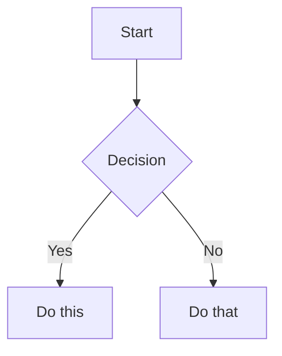

# GAL Agent Instructions

> Generated by `/gal init`. Do not edit manually.
> Update `.dev/project.md` or the GAL source docs, then rerun `/gal init`.

## Adapter Rules

- This is the shared cross-CLI contract generated from repo sources for Copilot CLI, Codex CLI, Gemini CLI (via settings bridge), and Claude Code CLI.
- All skills in this repo's `skills/` directory are inlined below so Codex and Claude Code always have a repo-local fallback, regardless of machine-level install state.
- This file is generated by `/gal init`. Do not edit manually.

<!-- Source: .dev/project.md -->
# Golem-Agents-Legion

## What This Is

GAL is a document-driven AI working system for solo developers who want a stable workflow across GitHub Copilot, Gemini CLI, Codex CLI, and Claude Code. It combines a small control-plane command surface, specialized golem agents, and repo-local state files so planning, implementation, testing, review, and research can move between tools without losing context.

## Tech Stack

| Layer | Technology |
| --- | --- |
| Language | Markdown, Bash, PowerShell |
| Framework | GAL command-and-agent workflow contracts |
| Database | None |
| Testing | Manual field validation, shell-script smoke runs, document-level review |
| CI/CD | Git-based local generation and machine setup scripts |

## Architecture

Portable source-of-truth repository. Tracked contracts live in `commands/`, `skills/`, `conventions/`, `workflows/`, `templates/`, `agent/`, and `scripts/`; generated adapters and repo state are produced from those sources for each initialized repo.

### Layer Map

| Layer | Namespace | Depends On |
| --- | --- | --- |
| Source Contracts | `commands/`, `skills/`, `conventions/`, `workflows/`, `templates/`, `agent/` | Nothing |
| Runtime Adapters | `scripts/`, generated repo-local adapter files | Source Contracts |
| Repo State | `.dev/`, `docs/plans/`, `docs/research/` | Source Contracts |
| Documentation | `README.md`, `ROADMAP.md`, `docs/` | Source Contracts, Repo State |

## Constraints

- Keep cross-runtime behavior aligned across Copilot, Gemini CLI, Codex CLI, and Claude Code — command drift breaks the control plane.
- Treat repo-owned Markdown files as the durable workflow state — temporary runtime output must not replace `.dev/` or plan files.
- Generated adapters must come from tracked templates and scripts, not hand-edited machine-local outputs.

## Response Style

- Keep answers minimal, professional, and straight to the point.
- Unless I explicitly ask for it, do not proactively suggest next steps or offer a summary of proposed changes at the end of the response.
- Remove unnecessary pleasantries and closing remarks.

## Freshness

- Always get today's date first, then use that date when querying for the latest information or other time-sensitive context.

## Protected Paths

- `commands/` — changing the public command surface affects every runtime.
- `conventions/` and `workflows/` — these define global workflow semantics used by all golem agents.
- `templates/` — template changes alter every initialized repo's durable state shape.
- `scripts/Sync-DevContext.ps1`, `scripts/sync-dev-context.sh`, `scripts/Setup-Machine.ps1`, `scripts/setup-machine.sh` — these files control generated adapter outputs and machine installation topology.

## Key Decisions

| Decision | Rationale | Date |
| --- | --- | --- |
| Keep a small public command surface and route execution-stage work to golem agents | Preserves a stable control plane while keeping specialist behavior explicit | 2026-04-21 |
| Use repo-owned `.dev/`, `docs/plans/`, and `docs/research/` as durable shared state | Keeps cross-tool continuity auditable and versioned | 2026-04-21 |
| Use this repo itself as the first macOS field-validation target | Closes deferred bootstrap checks with a real initialized repo and a real scoped feature flow | 2026-04-21 |

## Source Documents

| Path | Type | Notes |
| --- | --- | --- |
| `README.md` | README | |
| `docs/research/20260409-infra-lan-worker-topology-mempalace-shared-memory.md` | docs | |
| `docs/personalization.md` | docs | |
| `docs/plans/infra-lan-worker-topology.prompt.md` | docs | |
| `docs/devguide.md` | docs | |
| `docs/collaborative-tools/graphworkflow.md` | docs | |
| `docs/collaborative-tools/gstack.md` | docs | |
| `docs/collaborative-tools/remote-worker.md` | docs | |
| `docs/collaborative-tools/godot.md` | docs | |
| `docs/collaborative-tools/graphify.md` | docs | |
| `docs/collaborative-tools/checking-contract.md` | docs | |
| `docs/collaborative-tools/opencli.md` | docs | |

| Document | Path | Last Verified |
| --- | --- | --- |

## Verified Facts

- The repo's portable automation layer is split between PowerShell and Bash scripts under `scripts/`.
- Research workflow contracts are defined in `workflows/research.md` and owned by `golem-researcher` plus an independent verifier.
- Repo-local adapters are generated by `gal init` / Sync-DevContext into `.github/copilot-instructions.md`, `GEMINI.md`, `CLAUDE.md`, and `AGENTS.md`.

## Suspected Drift

- Older roadmap wording referred to `status/next/pause`; the current public surface is `/gal status`, `/gal whats-next`, and `/gal wrap-up`.

## Documentation Gaps

- Multi-machine execution-plane rollout remains open and is tracked separately from this repo-bootstrap closeout.
- Community getting-started and contribution documentation remain future milestone work.

<!-- Source: conventions/conventions.md -->
# Conventions

Portable rules that ALL Golem agents follow, regardless of which tool is being used.

## Active Conventions

| File | Content |
| --- | --- |
| [csharp.md](csharp.md) | C# / .NET 10 / C# 14 plus Godot C# runtime compatibility, node-script rules, and signals |
| [go.md](go.md) | Go: error handling, naming, project structure, table-driven tests |
| [typescript.md](typescript.md) | TypeScript: strict typing, naming, async, testing |
| [rust.md](rust.md) | Rust: safety, naming (RFC 430), data models, thiserror/anyhow |
| [token-budget.md](token-budget.md) | Token management: cold start priority, context handoff, knowledge flow |
| [working-hours.md](working-hours.md) | opt-in working-hours, After Hours, Wrap-up Time, and Hard Stop enforcement |

## Shared Skills

Universal cross-project guidance now lives in standalone skills:

- [git-commits](../skills/git-commits/SKILL.md)
- [structured-logging](../skills/structured-logging/SKILL.md)
- [result-pattern](../skills/result-pattern/SKILL.md)
- [markdown-formatting](../skills/markdown-formatting/SKILL.md)

<!-- Source: conventions/csharp.md -->
# C# / .NET Conventions

Target: **.NET 10** / **C# 14**. Use file-scoped namespaces, global usings, CRLF on Windows.

---

## Naming (Microsoft Style)

| Category | Convention | Example |
| --- | --- | --- |
| Classes, Records, Structs | `PascalCase` | `OrderValidation` |
| Interfaces | `I` + `PascalCase` | `IMenuStorage` |
| Methods, Properties | `PascalCase` | `ValidateAsync()` |
| Private instance/static fields | `_camelCase` | `_logger`, `_jsonOptions` |
| Constants (`const`) | `PascalCase` | `MaxRetries` |
| Local variables, parameters | `camelCase` | `orderCount` |
| Enums | `PascalCase` | `OrderState.Pending` |
| Type parameters | `T` prefix | `TResult` |
| Domain acronyms | Full caps | `LLM`, `ASR`, `API` |

---

## Modern C# Syntax

Always prefer newest syntax. Selection criteria: reads closer to English, then more concise.

| Feature (C# ver) | Prefer | Avoid |
| --- | --- | --- |
| Null-conditional assignment (14) | `customer?.Order = GetOrder();` | `if (customer is not null) ...` |
| `field` keyword (14) | `set { field = value.Trim(); }` | Manual `_name` backing field |
| Extension members (14) | `extension(Order) { ... }` | `static class OrderExtensions` |
| Collection expressions (12) | `[1, 2, 3]` | `new int[] { 1, 2, 3 }` |
| Primary constructors (12) | `class Svc(IDep dep)` | Manual ctor + `_dep` field |
| Raw string literals (11) | `"""{ "key": "val" }"""` | `"{ \"key\": \"val\" }"` |
| Required members (11) | `required string Name` | Ctor parameter for mandatory props |
| Pattern matching (9+) | `is null`, `is not null` | `== null`, `!= null` |
| Target-typed `new` (9) | `List<Order> orders = new();` | `var orders = new List<Order>();` when type obvious |
| Switch expressions (8) | `x switch { 1 => "a", _ => "b" }` | `switch` statement |

### Syntax Decision Tree

```text
Store injected dependency?         → Primary constructor
Backing field with custom logic?   → field keyword (C# 14)
Observable property in ViewModel?  → [ObservableProperty] partial property
Initialize a collection?           → Collection expression
Check for null?                    → Pattern matching (is null / is not null)
Branch on a value?                 → Switch expression
```

---

## Primary Constructors

Always use. No manual backing fields for injected services.

```csharp
// ✅
public class OrderService(IRepository repository, ILogger<OrderService> logger)
{
    public async Task ProcessAsync() => await repository.SaveAsync();
}
```

## ViewModels (CommunityToolkit.Mvvm)

Inherit `ObservableObject`. Use `[ObservableProperty]` with partial property syntax (8.4+).

```csharp
public partial class OrderViewModel(ILLMService llmService) : ObservableObject
{
    [ObservableProperty]
    public partial bool IsRecording { get; set; }

    [RelayCommand]
    private async Task ToggleRecordingAsync() => await llmService.StartAsync();
}
```

## Async/Await

- Always `async/await`. **Never** `.Result` or `.Wait()` (causes deadlocks).
- Use Constructor Injection. Never service locator pattern.

## Documentation Comments

**Self-documenting names over comments.** Only write `/// <summary>` when the name alone cannot convey non-obvious behavior, side effects, or constraints. Use `//` only for "why", never for "what".

---

## Clean Architecture

### Layer Dependencies

```text
[ Presentation ]    [ Infrastructure ]
         │                  │
         └────────┬─────────┘
                  ▼
           [ Application ]
                  │
                  ▼
             [ Domain ]
```

- **Domain**: Zero dependencies (entities, value objects, domain services)
- **Application**: Depends only on Domain (use cases, interfaces, DTOs)
- **Infrastructure**: Implements Application interfaces (DB, API, file system)
- **Presentation**: Depends on Application (ViewModels, UI)

### Placement Decision Tree

```text
New class → What does it do?
    ├─ Pure business rule, entity, value object?        → Domain
    ├─ Orchestrates use cases, defines interfaces?      → Application
    ├─ Talks to external systems (DB, API, LLM)?       → Infrastructure
    └─ Drives UI (ViewModel, page logic)?               → Presentation
```

### Key Rules

- Dependencies point inward. Inner layers must not know about outer layers.
- **Never duplicate folder names across layers** (use `UseCases/`, `DomainServices/`, `ExternalServices/` instead of `Services/` everywhere).
- Register DI in composition root (entry point), not in inner layers.

### Recommended Folders

| Layer | Folders |
| --- | --- |
| Domain | Entities, Models, Common, Constants, Enums |
| Application | Interfaces, Services, Stubs |
| Infrastructure | Adapters, LLMProviders, Storage, ASR |
| Presentation | ViewModels, Resources |

---

## Blazor

### Component Structure

- `PascalCase` for component files (`OrderList.razor`)
- Simple components: `@code { }` in `.razor`. Complex: partial class (`.razor.cs`)
- `[Parameter]` must be `public`. Use `[EditorRequired]` for mandatory. Use `[SupplyParameterFromQuery]` for URL params.
- Global `@using`/`@inject` in `_Imports.razor`. Don't duplicate in individual files.

### Events and Lifecycle

- Use `@onclick="MethodName"` (delegate) over lambda when no args needed
- Always use `Async` lifecycle methods (`OnInitializedAsync`)
- Implement `IDisposable` for event subscription cleanup

### Styling

- **MudBlazor first**: Use MudBlazor components over raw HTML
- Bootstrap utility classes for layout/spacing
- Custom CSS via CSS Isolation (`.razor.css`) with `kebab-case` classes
- Avoid inline styles

### Error Handling

- Wrap major UI sections in `<ErrorBoundary>`
- Follow Result pattern for logic errors

---

## Godot Runtime Rules

When code is loaded by the Godot runtime, compatibility takes priority over the newest language features in this document.

### Runtime Compatibility

| Code kind | Target | Guidance |
| --- | --- | --- |
| Godot node scripts and editor plugins | Godot-supported runtime for the project (currently .NET 8 / C# 12 baseline) | Do not use language features newer than the runtime Godot can compile and load |
| MCP servers, CLI tooling, and external automation | .NET 10 / C# 14 | Follow the rest of this document normally |

If a repo mixes Godot game code and external tooling, treat them as separate compatibility zones.

### Node Script Rules

- Godot node types must be `public partial class` and import `using Godot;`
- Do not use constructors or primary constructors on Godot node scripts; Godot instantiates these types itself
- Initialize scene references in `_Ready()` instead of constructor logic
- Keep Inspector-configurable data in `[Export]` members
- Use explicit `override` methods for lifecycle hooks

### Godot Attribute Mapping

| GDScript concept | C# pattern | Notes |
| --- | --- | --- |
| `@export` | `[Export]` | Add `PropertyHint` when Inspector constraints matter |
| `signal foo` | `[Signal] public delegate void FooEventHandler(...);` | Generated event name drops the `EventHandler` suffix |
| `@onready` | Assign in `_Ready()` | Use `GetNode<T>()` or cached node references |
| `await some_signal` | `await ToSignal(node, Node.SignalName.X)` | Prefer generated C# events for normal subscriptions |

### Lifecycle Patterns

- `_Ready()` for scene wiring and node lookup
- `_Process(double delta)` for frame-based logic
- `_PhysicsProcess(double delta)` for physics movement and collision work
- `_EnterTree()` and `_ExitTree()` for registration and cleanup that must track tree membership

### API and Collection Guidance

- Use PascalCase Godot APIs in C#: `GetNode`, `QueueFree`, `MoveAndSlide`, `Input.IsActionPressed`
- Use `GD.Print`, `GD.PushWarning`, and `GD.PushError` for Godot-facing diagnostics
- Prefer `List<T>` and `Dictionary<TKey, TValue>` for internal app logic
- Use `Godot.Collections.Array<T>`, `Godot.Collections.Dictionary`, and `Variant` when crossing the Godot API boundary
- Prefer `StringName`-based signal and method identifiers when the API exposes them

### Example Node Script

```csharp
using Godot;

public partial class PlayerController : CharacterBody2D
{
    [Export]
    public float Speed { get; set; } = 220.0f;

    private Sprite2D _sprite = null!;

    public override void _Ready()
    {
        _sprite = GetNode<Sprite2D>("Sprite2D");
    }

    public override void _PhysicsProcess(double delta)
    {
        var direction = Input.GetVector("move_left", "move_right", "move_up", "move_down");
        Velocity = direction * Speed;
        MoveAndSlide();

        if (direction.X != 0)
        {
            _sprite.FlipH = direction.X < 0;
        }
    }
}
```

<!-- Source: conventions/go.md -->
# Go Conventions

## Core Principles

- **Simplicity**: Prefer simple, readable code over clever abstractions
- **Idiomatic Go**: Follow [Effective Go](https://go.dev/doc/effective_go). Use `gofmt` formatting.
- **Concurrency**: Share memory by communicating (channels), don't communicate by sharing memory

## Error Handling

- Handle errors immediately. Never ignore with `_` unless explicitly safe.
- Use `if err != nil` guard clauses. Return early.
- Wrap with context: `fmt.Errorf("context: %w", err)`

```go
f, err := os.Open(filename)
if err != nil {
    return fmt.Errorf("failed to open config: %w", err)
}
defer f.Close()
```

## Naming

- **Exported**: `PascalCase` (`CalculateTotal`)
- **Internal**: `camelCase` (`parseInput`)
- **Short names**: Short scopes get short names (`i`, `r`)
- **Packages**: Short, lowercase, single word. No underscores.

## Project Structure

- Follow standard layout: `cmd/`, `pkg/`, `internal/`
- Use `internal/` for code that shouldn't be imported externally

## Testing

- **Table-driven tests** for multiple inputs/outputs
- Use `t.Parallel()` for unrelated unit tests

```go
func TestAdd(t *testing.T) {
    tests := []struct {
        a, b, want int
    }{
        {1, 2, 3},
        {0, 0, 0},
    }
    for _, tt := range tests {
        t.Run(fmt.Sprintf("%d+%d", tt.a, tt.b), func(t *testing.T) {
            if got := Add(tt.a, tt.b); got != tt.want {
                t.Errorf("Add() = %v, want %v", got, tt.want)
            }
        })
    }
}
```

<!-- Source: conventions/rust.md -->
# Rust Conventions

## Core Principles

- **Safety first**: Prefer safe Rust. Avoid `unsafe` unless strictly necessary for FFI.
- **Pure & stateless**: Core logic should be `fn(Input) -> Output`.
- **Error handling**: `Result<T, E>` with `thiserror` for libs, `anyhow` for apps. Never `unwrap()` in production.

## Code Style

- Must pass `cargo fmt` and `cargo clippy`
- Use `&str` and `&T` for borrowing. Avoid `.clone()` unless ownership required.

## Naming (RFC 430)

| Category | Convention | Example |
| --- | --- | --- |
| Crates, modules | `snake_case` | `order_parser` |
| Types (structs, enums, traits) | `UpperCamelCase` | `OrderItem`, `Validate` |
| Functions, methods | `snake_case` | `calculate_total` |
| Variables | `snake_case` | `user_id` |
| Constants, statics | `SCREAMING_SNAKE_CASE` | `MAX_RETRIES` |
| Files | `snake_case.rs` | `order_validator.rs` |

## Data Models

Always derive `Debug`, `Clone`, `Serialize`, `Deserialize`, `JsonSchema`.

- `String` for text fields (UTF-8)
- `rust_decimal::Decimal` for monetary values — `f32`/`f64` **forbidden** for prices

```rust
use rust_decimal::Decimal;
use schemars::JsonSchema;
use serde::{Deserialize, Serialize};

#[derive(Debug, Clone, Serialize, Deserialize, JsonSchema)]
pub struct PriceItem {
    pub name: String,
    pub amount: Decimal,
}
```

## Testing

- **TDD**: Write tests before implementation
- Unit tests in `mod tests` at bottom of source file
- Integration tests in `tests/` directory
- Use strict helper functions over heavy mocking frameworks

## Security

- Never commit API keys
- Always check pointers for null before dereferencing in `ffi.rs`
- All comments and docs in English (CJK allowed in string literals for testing only)

<!-- Source: conventions/token-budget.md -->
# Token Budget

Rules for managing context window and token consumption across all agents.

---

## Cold Start Priority

When an agent begins a session, load context in this order (stop when sufficient):

1. **`.dev/project.md`** — compressed project summary + indexes
2. **`.dev/state.md`** — active plan index + session continuity
3. **Active plan file** — `.dev/plans/<plan-slug>.prompt.md` (AI execution work file) with `## Status` section
4. **Source docs** — only when `project.md` explicitly references them for the current task
5. **Source code** — only files relevant to the current plan step

Do **not** read `README.md`, `docs/`, or full codebase on cold start. Let `project.md` guide what to load.

## During Work

- **Summarize early**: When a conversation exceeds ~20 exchanges, compress key decisions and findings into the plan's `## Status` or `## Handoff Notes`.
- **Don't repeat context**: If information is already in `project.md` or the plan, reference it — don't paste it into the conversation.
- **One plan at a time**: Focus on the active plan. Don't load unrelated plans.

## Agent Budget Guideline

Each agent's instruction set should consume **≤ 15%** of the available context window. If an agent's prompt grows beyond this, split into smaller focused sections or move reference material to separate files.

## `/gal wrap-up` Context Handoff

Before switching contexts (worktree, branch, session), run `/gal wrap-up` to:

1. Compress key conversation insights into plan `## Status > ### Handoff Notes`
2. Update `state.md` session continuity
3. Commit changes

This prevents the next session from re-deriving context that was already established.

## Knowledge Flow Direction

```text
Ephemeral (high token cost to replay)
    │
    ▼  compress into
Plan ## Status / ## Handoff Notes (medium-term)
    │
    ▼  extract into
docs/ (permanent, low token cost to reference)
    │
    ▼  index into
.dev/project.md (minimal token cost)
```

**Principle**: The more stable the knowledge, the closer it lives to `project.md`. The more transient, the closer it lives to the plan or scratch file.

<!-- Source: conventions/typescript.md -->
# TypeScript Conventions

## Core Principles

- **Strict typing**: `strict` mode enabled. Avoid `any`; use `unknown` if necessary.
- **Modern JS/TS**: ES6+ features (arrow functions, destructuring, spread).
- **Immutability**: Prefer `const` over `let`. No `var`.

## Type System

- `interface` for public API definitions and objects
- `type` for unions, intersections, or primitives
- Descriptive generic names (`TData`, `TResponse`) for complex functions
- Leverage utility types: `Partial`, `Pick`, `Omit`, `Record`

## Naming

| Category | Convention | Example |
| --- | --- | --- |
| Variables, functions | `camelCase` | `fetchUserData` |
| Classes, interfaces, types | `PascalCase` | `UserResponse` |
| Global constants | `SCREAMING_SNAKE_CASE` | `MAX_RETRIES` |
| Booleans | `is`/`has`/`should` prefix | `isLoading`, `hasError` |

## Async

- Always `async/await` over `.then()` chains
- `Promise.all` for parallel independent tasks

```typescript
async function getUserData(id: string): Promise<User> {
  const user = await db.findUser(id);
  if (!user) throw new Error("User not found");
  return user;
}
```

## Best Practices

- Explicit return types for exported functions
- Optional chaining (`?.`) and nullish coalescing (`??`) over manual checks
- Organize imports: external libs → internal absolute → relative

## Testing

- Jest or Vitest preferred
- Mock external dependencies for unit isolation

<!-- Source: conventions/working-hours.md -->
# Working Hours Convention

All Golem agents MUST resolve working-hours behavior before performing any work.
This convention is referenced by every agent and enforced at the workflow level.

The working-hours boundary is a machine-local preference, not a tracked repo-wide requirement. It is disabled unless the local configuration explicitly enables it.

## Machine-Local Settings

Read these values from local configuration when available:

| Setting | Meaning |
| --- | --- |
| `WORKING_HOURS_ENABLED` | Enables working-hours behavior when `true` |
| `WORKDAY_START` | Start of the preferred workday in `HH:MM` |
| `WORKDAY_END` | End of the preferred workday in `HH:MM` |
| `WRAP_UP_TIME` | Reminder or shutdown-window start in `HH:MM` |
| `HARD_STOP_TIME` | Hard stop in `HH:MM` |
| `OBSIDIAN_DIARY_DIR` | Diary location used to check whether today's diary exists |

If `WORKING_HOURS_ENABLED` is missing or `false`, skip all working-hours behavior and proceed normally.

## Time Windows

| Zone | Purpose |
| --- | --- |
| **Working Hours** | Informational schedule from `WORKDAY_START` to `WORKDAY_END` |
| **After Hours** | Any time outside `WORKDAY_START` to `WORKDAY_END` before the configured stop boundary |
| **Wrap-up Time** | `WRAP_UP_TIME` — warn, offer `/gal wrap-up`, and redirect to the after-hours owner if the diary is missing |
| **Hard Stop** | `HARD_STOP_TIME` — all agents refuse work |

## Rules by Time Window

### Working Hours Off

If `WORKING_HOURS_ENABLED=false` or unset, all agents operate normally. No restrictions.

### During Working Hours — Normal Operation

All agents operate normally. No restrictions.

### After Hours Before Wrap-up Time

After `WORKDAY_END`, agents may still proceed. This period is informational only. The shutdown ritual begins at `WRAP_UP_TIME`.

### From Wrap-up Time To Hard Stop — Shutdown Window

**Check**: Does today's diary exist at `<OBSIDIAN_DIARY_DIR>/YYYYMMDD_Work_Diary.md`?

The after-hours owner is the single Obsidian-writing agent, currently `@golem-notewriter`.

| Diary exists? | Agent is after-hours owner? | Action |
| --- | --- | --- |
| No | No | **BLOCK**. Print warning, redirect to the after-hours owner |
| No | Yes | Proceed with shutdown ritual |
| Yes | No | Allow **minor wrap-up only** (commit, push, save). Offer `/gal wrap-up` once, but run it only if the user explicitly agrees |
| Yes | Yes | Allow supplement or archive tasks only |

**Block message** (for non-owner agents):

```text
Past the configured Wrap-up Time and today's diary is not yet written.
Call the after-hours owner to complete the shutdown ritual before continuing other work.
```

**Wrap-up offer** (for non-owner agents when today's diary already exists):

```text
It is past the configured Wrap-up Time. Time to wrap up.
I can run /gal wrap-up for this repo if you want, but I will only do that if you explicitly confirm.
```

During the shutdown window:

- Offer `/gal wrap-up` at most once per invocation when the current repo is initialized and today's diary already exists.
- Do not run `/gal wrap-up` automatically.
- Only run `/gal wrap-up` after an explicit user confirmation such as `yes, run wrap-up`.
- If the repo is not initialized for GAL, do not offer `/gal wrap-up`; just give the working-hours reminder.

### At Or After Hard Stop

**ALL agents** (including the after-hours owner) refuse to work. Use this exact response:

```text
It is now past the configured Hard Stop. Per the owner's settings, work should stop now.
You can continue tomorrow from each repo's .dev/state.md.
```

No exceptions. No `just one more thing.`
Do not describe this as a workflow gate, approval gate, or manual override requirement unless the user explicitly asks about working-hours policy.

## Implementation

This convention is enforced by each agent reading `conventions/working-hours.md` as part of their startup check. The time check uses the system clock and compares it against the configured time strings:

```powershell
Get-Date -Format HH:mm
```

## Override

If the user explicitly says `override working hours`, `skip working hours`, or `override curfew`:

- Allow work but print a single reminder: `Working-hours boundary temporarily overridden. Remember to rest.`
- Do NOT nag repeatedly after override is granted.
- Override expires at next invocation (does not persist).
- Do not mention override proactively in the Hard Stop refusal message.

## Why This Exists

This is an optional self-imposed boundary to enforce healthy work habits. The agents serve the user, and when working hours are enabled they should protect the user from overwork without pretending the policy is repo-global.

<!-- Source: workflows/coding.md -->
# Coding Flow

The primary development workflow is control-plane-and-agent-driven, not dispatcher-state-driven.
Within Coding Flow, the primary work-file model is: source plans live in `docs/plans/`, execution prompts live in `.dev/plans/`, repo continuity lives in `.dev/state.md`, planning-stage domain reviews write back to the source plan, and execution-stage specialists write back to the `.dev/plans/<slug>.prompt.md` execution file.

Cross-model verification remains the default guardrail: planning critique, testing, and review should be done by different models whenever a separate capable model is available.

## Choosing Planning Depth

Not every change needs the same amount of planning. GAL uses command choice, not a named risk tier, to decide how much review to apply.

| Situation | Recommended Flow | Architect | Notes |
| --- | --- | --- | --- |
| Obvious local fix | Direct implement, optional `golem-reviewer`, optional `golem-tester` | Optional consult | Use when scope and impact are already clear |
| Scoped feature or known-cause bug | `/planning` -> `/refining-plan` -> `/plan-to-prompt` -> implement -> `golem-reviewer` -> conditional `golem-designer` or `golem-security` -> `golem-tester` -> `golem-releaser` | Optional consult | Use when the source plan is straightforward and does not need architectural challenge |
| Structural, cross-cutting, or uncertain change | `/planning` -> `/deep-planning` -> `/refining-plan` -> `/plan-to-prompt` -> implement -> `golem-reviewer` -> conditional `golem-designer` or `golem-security` -> `golem-tester` -> `golem-releaser` | Required in `/deep-planning` | Use when the plan touches shared structure, dependencies, public interfaces, or protected paths |

If implementation uncovers architectural uncertainty, stop and return to `/deep-planning` before continuing. After planning-stage changes, rerun `/refining-plan` before regenerating the execution prompt with `/plan-to-prompt`.

## Execution Lifecycle

GAL's coding flow is expressed as write-back command phases.

| Phase | Entry Signal | Owners | Main Files / Outputs |
| --- | --- | --- | --- |
| **Draft plan** | No active plan, or an existing plan needs reset | `/planning`, `/deep-planning`, `/refining-plan`, `/plan-to-prompt` | `docs/plans/<slug>.md`, `.dev/plans/<slug>.prompt.md`, `.dev/state.md` active plan row |
| **Planning reviews** | Source plan exists, buildability not yet locked | Business, design, and engineering review lanes via collaborative tools or fallback golems | `## Open Questions`, `## Tasks`, `## Review Results`, `## Test Plan` |
| **Implementation** | Tasks exist and work remains | Manual execution or `/gal pipeline` | `## Status`, `## Tasks`, code changes |
| **Review-stage audits** | Implementation reached a meaningful checkpoint | `golem-reviewer`, conditional `golem-designer`, conditional `golem-security`, `golem-tester` | `## Analyze`, `## Review Results`, `## Test Results` |
| **Wrap-up or release** | Work is paused or ready to land | `/gal wrap-up`, `golem-releaser` | `### Handoff Notes`, `.dev/state.md`, `## Release` |

The `Workflow:` field inside `## Status` is a **plan phase marker**, not a dispatcher-owned state machine. It may be useful for humans and specialist commands, but readiness is determined by the presence and contents of plan files and sections such as `## Tasks`, `## Analyze`, `## Review Results`, and `## Test Results`.

`golem-reviewer` and `golem-designer` both belong to the post-implementation review stage when used in audit mode. `golem-reviewer` audits correctness, completeness, and scope drift in the code changes; `golem-designer` audits the running UI against `DESIGN.md`; `golem-security` is a code-review-level security audit over implemented changes for branches that touch auth, data handling, input handling, or public API surface.

## Planning Reviews

`/deep-planning` always activates architect review before a plan is treated as implementation-ready.

- **Architect**: always activates (mandatory) in `/deep-planning`; checks trade-offs, over-engineering, bug surface, dependency pollution, and public API risk.
- **Analyst**: auto-activates when content touches business rules, pricing, permissions, notifications, onboarding, eligibility, or other customer-visible logic.
- **Designer**: auto-activates when content touches customer-facing flows, layout, states, components, or accessibility-sensitive interactions.

Each domain lane can also be invoked directly against the source plan outside of `/deep-planning` when that specialist review is needed without an architect-led deep-planning pass.

Planning-stage security concerns still sit with architect during `/deep-planning`, especially around trust boundaries, risky interfaces, and security-sensitive design decisions. `golem-security` does not replace that planning review; it audits the implemented branch once code exists.

Implementation-stage `REVIEWER` and `DEBUGGER` remain separate specialists. They do not replace planning review.

## Collaborative Tool Preflight

Before planning, review, or specialist lanes attempt to use a collaborative tool, resolve the tool state through [docs/collaborative-tools/checking-contract.md](../docs/collaborative-tools/checking-contract.md).

| Workflow phase | Tools that may apply | Degrade behavior |
| --- | --- | --- |
| `/planning` and `/deep-planning` | graphify for structural context, gstack for optional review lanes | Continue with native planning and fallback golems |
| review-stage audit | graphify for cross-community coupling checks | Continue with standard diff-based review |
| research workflows | OpenCLI for structured external retrieval | Fall back to MCP retrieval or browser tools |

Do not treat a missing collaborative tool as a workflow error. Do not prompt for install or initialization unless the user explicitly asked for the tool-specific capability.

## Architectural Escalation Fence

Implementation must stop and return to `/deep-planning` if the work requires any of the following structural changes:

- Create or delete project files (.csproj, .sln, package.json, etc.)
- Add or remove package dependencies
- Move files across architecture layers
- Create new interfaces or abstract base classes
- Modify DI registrations or service composition
- Change public API signatures used by 2+ consumers
- Introduce new design patterns
- Modify shared/core/base classes used by 3+ consumers

These changes need an architect-reviewed plan before implementation continues.

## Session Safety Mode

Session safety is now agent-internal discipline, not a public command family.

- `golem-debugger` owns freeze-style scope control during investigations
- destructive shell operations still require explicit caution and user clarity
- do not reintroduce session-safety slash commands as public workflow steps

## Protected Paths

Each repo's `.dev/project.md` contains a `## Protected Paths` section listing architecture-critical files. Touching any protected path requires a return to `/deep-planning` before implementation continues.

## Plan Lifecycle: Transient Task Memory

Plans are temporary work files, not permanent records. `docs/plans/` is a staging area.

### Lifecycle

1. **`/planning` creates the source plan** → `docs/plans/<type>-<slug>.md`
2. **`/deep-planning` refines the source plan when needed** → keeps scope and rationale review-ready
3. **`/refining-plan` writes the implementation contract into the source plan** → `## Tasks`, `## Test Plan`, `## Review Results > ### Engineering Review`
4. **`/plan-to-prompt` creates or refreshes the execution prompt from that reviewed source plan** → `.dev/plans/<type>-<slug>.prompt.md`
5. **The execution prompt self-tracks progress** → `## Status` carries phase markers, step, deviations, and decisions
6. **Implementation updates progress** during execution (not `.dev/state.md`)
7. **Testing and review write results** → execution prompt `## Test Results`, `## Review Results`, `## Analyze`
8. **Verification confirms the goal** → extracts knowledge to `docs/`, marks the plan ready for closure
9. **Plan is deleted after lifecycle closure** → task memory returns to zero, no orphaned state

### Plan Filename Convention

```text
docs/plans/<type>-<slug>.md
.dev/plans/<type>-<slug>.prompt.md
```

Type prefixes: `feat-`, `fix-`, `refactor-`, `sec-`, `perf-`, `infra-`

### Safety Rules

- **Never delete a plan before verification and handoff are complete** — the plan is the spec; early deletion breaks review, QA, and resumption.
- **Plan is pipeline, docs/ is sink** — valuable knowledge flows from the plan into long-lived docs. The plan itself is disposable only after that extraction.

## State File Role

`.dev/state.md` is a **global index + session continuity** file, not a per-task tracker.

| Responsibility | Where |
| --- | --- |
| Per-task phase marker, step progress, deviations | **Plan file** `## Status` |
| Active plans index (which branches have active plans) | **state.md** |
| Repo-level blockers, cross-plan decisions | **state.md** |
| Session continuity (last session, stopped at, next step) | **state.md** |

## Context Handoff

Before switching worktrees or ending a session:

1. Compress key context into the plan's `## Status > ### Handoff Notes`
2. Update `.dev/state.md` Session Continuity section
3. Commit changes to the current branch

This is manually triggered — the AI does not know when you're switching context unless you record it.

## Direct Agent Invocation

| Type | Allowed | Examples |
| --- | --- | --- |
| **Consult** | Yes — read-only or scoped advice, no implied phase transition | `/gal architect`, `/gal analyst` |
| **Utility** | Yes — independent helper | `/gal debugger`, `/gal notewriter` |
| **Pipeline** | Yes | `/gal tester`, `/gal reviewer` for bounded specialist work; `/gal pipeline` remains the full chained execution path |

Examples above use the literal dispatcher-facing golem names. Consult output is advice unless the named agent's contract explicitly includes formal write-back for that specialist stage.

## Per-Phase Model Assignment

Model assignment is defined in [model-roles.md](../model-roles.md).

Key rules:

- **The planning author and architect should differ when practical** — cross-check the plan before implementation
- **The planning author and designer should differ when designer is a formal reviewer** — keep design critique independent from plan authorship
- **Implementer and tester must be different models** — independent verification
- **Reviewer should differ from implementer** — fresh perspective
- **Reviewer should also differ from tester when practical** — review should be higher-level than test generation
- **Reviewer model tier ≥ implementer model tier** — the reviewer must be at least as capable
- **Reviewer model tier ≥ tester model tier** — review should be at least as capable as test generation and usually stronger

<!-- Source: model-roles.md -->
# Model Roles

Define roles by **what they do**, not by which model they are.
When you switch AI tools, update the mapping table — everything else stays the same.

Default principle: formal cross-checks should use a different model from the one that authored the work file whenever practical.

## Roles

| Role | Purpose | Key Trait |
| --- | --- | --- |
| ARCHITECT | Adversarial plan review — trade-offs, over-engineering, bugs | Critical thinking, minimalism, direct communication |
| ANALYST | Business logic review — ROI, domain correctness, user impact | Commercial awareness, domain expertise |
| DESIGNER | Review visual design, UX flow, accessibility, and design-system consistency | Experience design judgment, user empathy |
| RESEARCHER | Investigate unknowns, synthesize findings, cross-review sources, and prepare research outputs for independent verification | Evidence gathering, source attribution, synthesis |
| CODER | Write implementation code following a plan | Code generation, refactoring |
| TESTER | Write tests from plan spec + public API only | Spec-driven, usually basic unit/integration coverage |
| REVIEWER | Review code for bugs, security, style | Higher-level critical eye, different perspective |
| NOTEWRITER | Obsidian writes — diary, private captures, inbox processing, and knowledge extraction | Note authoring, Guide-aware fallback, private vs. durable routing |
| LOCAL | Tasks requiring privacy or local language | Runs on-device, no data leaves machine |

## Routing Rules

1. **Planning review should be a different-model check** — the model that critiques a plan should differ from the one that drafted it whenever practical.
2. **CODER and TESTER must be different models** — independent verification
3. **REVIEWER should differ from CODER** — fresh perspective catches blind spots
4. **REVIEWER should also differ from TESTER when practical** — review is a higher-level check than test generation
5. **DESIGNER should differ from CODER when used as a formal reviewer** — keep experience review independent from implementation
6. **RESEARCHER owns research, synthesis, and cross-review** — independent reference verification must be done by a different model
7. **NOTEWRITER** handles all Obsidian writes — it should load the user's configured Guide when available and fall back to generic mode when not
8. **LOCAL** is for privacy-sensitive data or Traditional Chinese tasks
9. When switching tools, update the **Current Mapping** table below only

## Planning Review Rules

`/deep-planning` is the default architect-reviewed planning pass before prompt generation.

| Reviewer | When Included | Verdict Required? |
| --- | --- | --- |
| **ARCHITECT** | Every `/deep-planning` pass | Yes — review required before `/plan-to-prompt` |
| **ANALYST** | Business rules, pricing, permissions, customer-visible logic | Yes — when included |
| **DESIGNER** | Customer-facing flows, layout, states, component systems, accessibility-sensitive work | Yes — when included |

Implementation-stage `REVIEWER` and `DEBUGGER` remain separate specialists. They do not replace planning review.

## Typical Workflow (Single Developer)

```text
1. `/planning` or `/deep-planning` → Use a frontier-class model (interactive or async) to produce the initial plan
2. Plan reviews → Use different models for architect, design, or business critiques when practical
3. IMPLEMENT → Use a standard coding agent — follow the approved plan
4. TEST → Use a DIFFERENT model — feed it plan + public interfaces only; this is usually basic unit/integration coverage
5. REVIEW → Use a DIFFERENT model again — bugs, security, architecture; this should be a higher-level check than TEST
6. VERIFY → Run full test suite, confirm all plan items implemented
```

Research workflow note: `/gal research` and `/gal deep-research` have their own VERIFY state for citation checking. That VERIFY pass must use a different model from the research author.

---

## Your Setup

Copy [`model-roles.example.md`](model-roles.example.md) to `model-roles.local.md` and customize
with your own machines, models, and tools. The local file is git-ignored.

<!-- Source: skills/defuddle/SKILL.md -->
---
name: defuddle
description: Extract clean markdown content from web pages using Defuddle CLI, removing clutter and navigation to save tokens. Use instead of WebFetch when the user provides a URL to read or analyze, for online documentation, articles, blog posts, or any standard web page.
cliDependencies:
  required:
    - defuddle
mcpDependencies:
  optional:
    - fetch
    - imagefetch
---

# Defuddle

Use Defuddle CLI to extract clean readable content from web pages. Prefer over WebFetch for standard web pages — it removes navigation, ads, and clutter, reducing token usage.

## Preferred Tool Order

1. Use Defuddle for standard article-style pages where clean markdown extraction is the main goal.
2. Use `fetch` when Defuddle is unavailable, the page is not article-like, or raw retrieval is preferable.
3. Use `imagefetch` when the task depends on understanding page images as well as text.

## Availability Check

Before using Defuddle, verify the CLI is installed:

```bash
defuddle --help
```

- Exit code `0`: Defuddle is available.
- Non-zero or command-not-found: Defuddle is unavailable. Use the fallback strategy below.

If Defuddle is unavailable, the page is not a standard article page, or you need raw page retrieval rather than article extraction, fall back to the `fetch` MCP when it is available. If the task depends on understanding page images, prefer `imagefetch` over plain fetch.

If not installed: `npm install -g defuddle`

## Fallback Strategy

- Use `fetch` for raw or general page retrieval when Defuddle is unavailable.
- Use `imagefetch` instead of plain `fetch` when page imagery is part of the task.
- If the page is highly interactive rather than article-like, switch to a browser-oriented tool instead of forcing Defuddle.

## No-Tool Behavior

If neither Defuddle nor the documented MCP fallback is available, say that clean page extraction is unavailable in the current runtime.

- Ask the user for the source URL or page content if a manual path is still viable.
- Do not describe the extraction as complete when the tool path was missing.

## Usage

Always use `--md` for markdown output:

```bash
defuddle parse <url> --md
```

Save to file:

```bash
defuddle parse <url> --md -o content.md
```

Extract specific metadata:

```bash
defuddle parse <url> -p title
defuddle parse <url> -p description
defuddle parse <url> -p domain
```

## Output formats

| Flag | Format |
| --- | --- |
| `--md` | Markdown (default choice) |
| `--json` | JSON with both HTML and markdown |
| (none) | HTML |
| `-p <name>` | Specific metadata property |

<!-- Source: skills/doc-coauthoring/SKILL.md -->
---
name: doc-coauthoring
description: Guide users through a structured workflow for co-authoring documentation. Use when user wants to write documentation, proposals, technical specs, decision docs, or similar structured content. This workflow helps users efficiently transfer context, refine content through iteration, and verify the doc works for readers. Trigger when user mentions writing docs, creating proposals, drafting specs, or similar documentation tasks.
mcpDependencies:
  optional:
    - fetch
    - filesystem
    - context7
---

# Doc Co-Authoring Workflow

This skill provides a structured workflow for guiding users through collaborative document creation. Act as an active guide, walking users through three stages: Context Gathering, Refinement & Structure, and Reader Testing.

When MCP tools are available, use them deliberately during context gathering:

- Use `fetch` for shared web docs, specs, tickets, or wiki pages
- Use `filesystem` for local project docs the user points at
- Use `context7` when the document depends on current library, framework, SDK, or API documentation

If one of these MCPs is unavailable, continue the workflow and ask the user for the missing material directly rather than blocking.

## When to Offer This Workflow

**Trigger conditions:**
- User mentions writing documentation: "write a doc", "draft a proposal", "create a spec", "write up"
- User mentions specific doc types: "PRD", "design doc", "decision doc", "RFC"
- User seems to be starting a substantial writing task

**Initial offer:**
Offer the user a structured workflow for co-authoring the document. Explain the three stages:

1. **Context Gathering**: User provides all relevant context while Claude asks clarifying questions
2. **Refinement & Structure**: Iteratively build each section through brainstorming and editing
3. **Reader Testing**: Test the doc with a fresh Claude (no context) to catch blind spots before others read it

Explain that this approach helps ensure the doc works well when others read it (including when they paste it into Claude). Ask if they want to try this workflow or prefer to work freeform.

If user declines, work freeform. If user accepts, proceed to Stage 1.

## Stage 1: Context Gathering

**Goal:** Close the gap between what the user knows and what Claude knows, enabling smart guidance later.

### Initial Questions

Start by asking the user for meta-context about the document:

1. What type of document is this? (e.g., technical spec, decision doc, proposal)
2. Who's the primary audience?
3. What's the desired impact when someone reads this?
4. Is there a template or specific format to follow?
5. Any other constraints or context to know?

Inform them they can answer in shorthand or dump information however works best for them.

**If user provides a template or mentions a doc type:**
- Ask if they have a template document to share
- If they provide a link to a shared document, use the appropriate integration to fetch it
- If they provide a file, read it

**If user mentions editing an existing shared document:**
- Use the appropriate integration to read the current state
- Check for images without alt-text
- If images exist without alt-text, explain that when others use Claude to understand the doc, Claude won't be able to see them. Ask if they want alt-text generated. If so, request they paste each image into chat for descriptive alt-text generation.

### Info Dumping

Once initial questions are answered, encourage the user to dump all the context they have. Request information such as:
- Background on the project/problem
- Related team discussions or shared documents
- Why alternative solutions aren't being used
- Organizational context (team dynamics, past incidents, politics)
- Timeline pressures or constraints
- Technical architecture or dependencies
- Stakeholder concerns

Advise them not to worry about organizing it - just get it all out. Offer multiple ways to provide context:
- Info dump stream-of-consciousness
- Point to team channels or threads to read
- Link to shared documents

**If integrations are available** (e.g., Slack, Teams, Google Drive, SharePoint, or other MCP servers), mention that these can be used to pull in context directly. Prefer MCP-based retrieval before asking the user to manually paste long documents.

**If no integrations are detected and in Claude.ai or Claude app:** Suggest they can enable connectors in their Claude settings to allow pulling context from messaging apps and document storage directly.

Inform them clarifying questions will be asked once they've done their initial dump.

**During context gathering:**

- If user mentions team channels or shared documents:
  - If integrations available: Inform them the content will be read now, then use the appropriate integration
  - If integrations not available: Explain lack of access. Suggest they enable connectors in Claude settings, or paste the relevant content directly.

- If user mentions entities/projects that are unknown:
  - Ask if connected tools should be searched to learn more
  - Wait for user confirmation before searching

- As user provides context, track what's being learned and what's still unclear

**Asking clarifying questions:**

When user signals they've done their initial dump (or after substantial context provided), ask clarifying questions to ensure understanding:

Generate 5-10 numbered questions based on gaps in the context.

Inform them they can use shorthand to answer (e.g., "1: yes, 2: see #channel, 3: no because backwards compat"), link to more docs, point to channels to read, or just keep info-dumping. Whatever's most efficient for them.

**Exit condition:**
Sufficient context has been gathered when questions show understanding - when edge cases and trade-offs can be asked about without needing basics explained.

**Transition:**
Ask if there's any more context they want to provide at this stage, or if it's time to move on to drafting the document.

If user wants to add more, let them. When ready, proceed to Stage 2.

## Stage 2: Refinement & Structure

**Goal:** Build the document section by section through brainstorming, curation, and iterative refinement.

**Instructions to user:**
Explain that the document will be built section by section. For each section:
1. Clarifying questions will be asked about what to include
2. 5-20 options will be brainstormed
3. User will indicate what to keep/remove/combine
4. The section will be drafted
5. It will be refined through surgical edits

Start with whichever section has the most unknowns (usually the core decision/proposal), then work through the rest.

**Section ordering:**

If the document structure is clear:
Ask which section they'd like to start with.

Suggest starting with whichever section has the most unknowns. For decision docs, that's usually the core proposal. For specs, it's typically the technical approach. Summary sections are best left for last.

If user doesn't know what sections they need:
Based on the type of document and template, suggest 3-5 sections appropriate for the doc type.

Ask if this structure works, or if they want to adjust it.

**Once structure is agreed:**

Create the initial document structure with placeholder text for all sections.

**If access to files is available:**
Use `create_file` to create a file. This gives both Claude and the user a scaffold to work from.

Inform them that the initial structure with placeholders for all sections will be created.

Create the file with all section headers and brief placeholder text like "[To be written]" or "[Content here]".

Provide the scaffold link and indicate it's time to fill in each section.

**If no access to files:**
Create a markdown file in the working directory. Name it appropriately (e.g., `decision-doc.md`, `technical-spec.md`).

Inform them that the initial structure with placeholders for all sections will be created.

Create file with all section headers and placeholder text.

Confirm the filename has been created and indicate it's time to fill in each section.

**For each section:**

### Step 1: Clarifying Questions

Announce work will begin on the [SECTION NAME] section. Ask 5-10 clarifying questions about what should be included:

Generate 5-10 specific questions based on context and section purpose.

Inform them they can answer in shorthand or just indicate what's important to cover.

### Step 2: Brainstorming

For the [SECTION NAME] section, brainstorm [5-20] things that might be included, depending on the section's complexity. Look for:
- Context shared that might have been forgotten
- Angles or considerations not yet mentioned

Generate 5-20 numbered options based on section complexity. At the end, offer to brainstorm more if they want additional options.

### Step 3: Curation

Ask which points should be kept, removed, or combined. Request brief justifications to help learn priorities for the next sections.

Provide examples:
- "Keep 1,4,7,9"
- "Remove 3 (duplicates 1)"
- "Remove 6 (audience already knows this)"
- "Combine 11 and 12"

**If user gives freeform feedback** (e.g., "looks good" or "I like most of it but...") instead of numbered selections, extract their preferences and proceed. Parse what they want kept/removed/changed and apply it.

### Step 4: Gap Check

Based on what they've selected, ask if there's anything important missing for the [SECTION NAME] section.

### Step 5: Drafting

Use `str_replace` to replace the placeholder text for this section with the actual drafted content.

Announce the [SECTION NAME] section will be drafted now based on what they've selected.

**If using files:**
After drafting, provide a link to the file.

Ask them to read through it and indicate what to change. Note that being specific helps learning for the next sections.

**If using a file:**
After drafting, confirm completion.

Inform them the [SECTION NAME] section has been drafted in [filename]. Ask them to read through it and indicate what to change. Note that being specific helps learning for the next sections.

**Key instruction for user (include when drafting the first section):**
Provide a note: Instead of editing the doc directly, ask them to indicate what to change. This helps learning of their style for future sections. For example: "Remove the X bullet - already covered by Y" or "Make the third paragraph more concise".

### Step 6: Iterative Refinement

As user provides feedback:
- Use `str_replace` to make edits (never reprint the whole doc)
- **If using files:** Provide link to the file after each edit
- **If using files:** Just confirm edits are complete
- If user edits doc directly and asks to read it: mentally note the changes they made and keep them in mind for future sections (this shows their preferences)

**Continue iterating** until user is satisfied with the section.

### Quality Checking

After 3 consecutive iterations with no substantial changes, ask if anything can be removed without losing important information.

When section is done, confirm [SECTION NAME] is complete. Ask if ready to move to the next section.

**Repeat for all sections.**

### Near Completion

As approaching completion (80%+ of sections done), announce intention to re-read the entire document and check for:
- Flow and consistency across sections
- Redundancy or contradictions
- Anything that feels like "slop" or generic filler
- Whether every sentence carries weight

Read entire document and provide feedback.

**When all sections are drafted and refined:**
Announce all sections are drafted. Indicate intention to review the complete document one more time.

Review for overall coherence, flow, completeness.

Provide any final suggestions.

Ask if ready to move to Reader Testing, or if they want to refine anything else.

## Stage 3: Reader Testing

**Goal:** Test the document with a fresh Claude (no context bleed) to verify it works for readers.

**Instructions to user:**
Explain that testing will now occur to see if the document actually works for readers. This catches blind spots - things that make sense to the authors but might confuse others.

### Testing Approach

**If access to sub-agents is available (e.g., in Claude Code):**

Perform the testing directly without user involvement.

### Step 1: Predict Reader Questions

Announce intention to predict what questions readers might ask when trying to discover this document.

Generate 5-10 questions that readers would realistically ask.

### Step 2: Test with Sub-Agent

Announce that these questions will be tested with a fresh Claude instance (no context from this conversation).

For each question, invoke a sub-agent with just the document content and the question.

Summarize what Reader Claude got right/wrong for each question.

### Step 3: Run Additional Checks

Announce additional checks will be performed.

Invoke sub-agent to check for ambiguity, false assumptions, contradictions.

Summarize any issues found.

### Step 4: Report and Fix

If issues found:
Report that Reader Claude struggled with specific issues.

List the specific issues.

Indicate intention to fix these gaps.

Loop back to refinement for problematic sections.

---

**If no access to sub-agents (e.g., claude.ai web interface):**

The user will need to do the testing manually.

### Step 1: Predict Reader Questions

Ask what questions people might ask when trying to discover this document. What would they type into Claude.ai?

Generate 5-10 questions that readers would realistically ask.

### Step 2: Setup Testing

Provide testing instructions:
1. Open a fresh Claude conversation: https://claude.ai
2. Paste or share the document content (if using a shared doc platform with connectors enabled, provide the link)
3. Ask Reader Claude the generated questions

For each question, instruct Reader Claude to provide:
- The answer
- Whether anything was ambiguous or unclear
- What knowledge/context the doc assumes is already known

Check if Reader Claude gives correct answers or misinterprets anything.

### Step 3: Additional Checks

Also ask Reader Claude:
- "What in this doc might be ambiguous or unclear to readers?"
- "What knowledge or context does this doc assume readers already have?"
- "Are there any internal contradictions or inconsistencies?"

### Step 4: Iterate Based on Results

Ask what Reader Claude got wrong or struggled with. Indicate intention to fix those gaps.

Loop back to refinement for any problematic sections.

---

### Exit Condition (Both Approaches)

When Reader Claude consistently answers questions correctly and doesn't surface new gaps or ambiguities, the doc is ready.

## Final Review

When Reader Testing passes:
Announce the doc has passed Reader Claude testing. Before completion:

1. Recommend they do a final read-through themselves - they own this document and are responsible for its quality
2. Suggest double-checking any facts, links, or technical details
3. Ask them to verify it achieves the impact they wanted

Ask if they want one more review, or if the work is done.

**If user wants final review, provide it. Otherwise:**
Announce document completion. Provide a few final tips:
- Consider linking this conversation in an appendix so readers can see how the doc was developed
- Use appendices to provide depth without bloating the main doc
- Update the doc as feedback is received from real readers

## Tips for Effective Guidance

**Tone:**
- Be direct and procedural
- Explain rationale briefly when it affects user behavior
- Don't try to "sell" the approach - just execute it

**Handling Deviations:**
- If user wants to skip a stage: Ask if they want to skip this and write freeform
- If user seems frustrated: Acknowledge this is taking longer than expected. Suggest ways to move faster
- Always give user agency to adjust the process

**Context Management:**
- Throughout, if context is missing on something mentioned, proactively ask
- Don't let gaps accumulate - address them as they come up

**File Management:**
- Use `create_file` for drafting full sections
- Use `str_replace` for all edits
- Provide the file link after every change
- Never use files for brainstorming lists - that's just conversation

**Quality over Speed:**
- Don't rush through stages
- Each iteration should make meaningful improvements
- The goal is a document that actually works for readers

<!-- Source: skills/game-2d-assets/SKILL.md -->
---
name: game-2d-assets
description: AI-first workflow for 2D game art and illustration assets. Use when generating character art, prop art, card art, painted icons, portraits, or other raster 2D assets that start in ComfyUI and finish in GIMP.
license: Complete terms in LICENSE.txt
---

# Game 2D Assets

Use this skill for non-pixel raster game art.

## Preferred Tool Order

1. Use ComfyUI for ideation, style consistency, and candidate generation.
2. Use GIMP for cleanup, compositing, alpha fixes, and final export.

## Common Tasks

| Task | Preferred Path |
| --- | --- |
| Character portrait variants | ComfyUI -> GIMP |
| Item illustration with transparent background | ComfyUI -> GIMP |
| Card or key art direction | ComfyUI -> GIMP |
| Batch variation for a single style family | ComfyUI defaults plus GIMP cleanup |

## Decision Tree

```text
Need non-pixel 2D art?
    -> ComfyUI for generation

Need cleanup, compositing, alpha fixes, or export sizing?
    -> GIMP
```

## Output Requirements

When using this skill:

1. Produce named candidate variants before cleanup.
2. Export final PNG or WebP in game-ready dimensions.
3. Preserve prompt, seed, or style references where practical.
4. Do not route this lane through Krita in the first release.

<!-- Source: skills/game-3d-assets/SKILL.md -->
---
name: game-3d-assets
description: AI-first workflow for 3D game assets. Use when generating concept sheets, turnarounds, texture references, or material direction in ComfyUI, then using Blender for general 3D work, preview renders, and export.
license: Complete terms in LICENSE.txt
---

# Game 3D Assets

Use this skill for 3D game asset production.

## Preferred Tool Order

1. Use ComfyUI for concept sheets, turnarounds, texture references, and material direction.
2. Use Blender by default for game-asset modeling, scene setup, baking, preview renders, and export.
3. Keep the 3D lane focused on Blender unless a new free tool is explicitly added later.

## Common Tasks

| Task | Preferred Path |
| --- | --- |
| General 3D prop | ComfyUI -> Blender |
| Stylized environment prop | ComfyUI -> Blender |
| Mechanical or product-like prop | ComfyUI -> Blender |
| Clean-silhouette hard-surface base | ComfyUI -> Blender |
| Bake and preview render | Blender |

## Decision Tree

```text
Need a 3D game asset?
    -> ComfyUI for concept and references

Need modeling, baking, rendering, or export?
    -> Blender
```

## Output Requirements

When using this skill:

1. Produce a concept or reference file before modeling.
2. Use Blender as the documented 3D production tool.
3. Keep the lane reproducible with source files and preview renders.
4. End with preview renders plus an export-ready source package.

<!-- Source: skills/game-asset-export/SKILL.md -->
---
name: game-asset-export
description: Finalize and package AI-first game assets for downstream use. Use when exporting final PNG, WebP, SVG, spritesheets, preview renders, transparent backgrounds, or structured output packages after a lane-specific asset workflow is complete.
license: Complete terms in LICENSE.txt
---

# Game Asset Export

Use this skill to package lane outputs into usable deliverables.

## Preferred Tool Order

1. Finish the lane-specific source asset first.
2. Export in the tool that owns the final format semantics.
3. Normalize names, dimensions, and variant structure before handoff.

## Common Tasks

| Task | Preferred Path |
| --- | --- |
| Final raster export | GIMP |
| Spritesheet export | Aseprite |
| SVG or icon export | Inkscape |
| 3D preview render and mesh export | Blender |

## Decision Tree

```text
Need final raster image outputs?
    -> GIMP

Need spritesheet or animation sheet?
    -> Aseprite

Need vector outputs?
    -> Inkscape

Need 3D preview renders or mesh exports?
    -> Blender
```

## Output Requirements

When using this skill:

1. Export the final asset in the owning lane tool, not from an earlier draft stage.
2. Use deterministic names for variants and states.
3. Capture target dimensions, sheet layout, or export format in the handoff notes.
4. Ensure the exported package is directly usable by a downstream game project or content pipeline.

<!-- Source: skills/game-pixel-assets/SKILL.md -->
---
name: game-pixel-assets
description: AI-first workflow for pixel-art game assets. Use when generating pixel sprites, enemies, items, tiles, simple animations, or spritesheets by starting with ComfyUI direction work and finishing in Aseprite through pixel-mcp.
license: Complete terms in LICENSE.txt
---

# Game Pixel Assets

Use this skill for pixel-art production.

## Preferred Tool Order

1. Use ComfyUI for silhouette exploration, direction, or variation.
2. Use Aseprite through `pixel-mcp` for final production work.

## Common Tasks

| Task | Preferred Path |
| --- | --- |
| Enemy sprite ideation | ComfyUI -> Aseprite |
| Item icon sprite | ComfyUI -> Aseprite |
| Animation cleanup | Aseprite |
| Spritesheet export | Aseprite |

## Decision Tree

```text
Need pixel-art output?
    -> ComfyUI for direction if needed
    -> Aseprite for production cleanup and export
```

## Output Requirements

When using this skill:

1. Keep a source `.aseprite` or `.ase` file when the asset continues evolving.
2. Define palette and frame size before final export.
3. Export spritesheets with explicit layout and dimension choices.
4. Treat ComfyUI outputs as reference material unless they already match the lane's pixel constraints.

<!-- Source: skills/game-ui-assets/SKILL.md -->
---
name: game-ui-assets
description: AI-first workflow for UI, icon, and HUD assets in games. Use when generating visual direction in ComfyUI, building component and layout states in Figma, and performing SVG cleanup or export work in Inkscape.
license: Complete terms in LICENSE.txt
---

# Game UI Assets

Use this skill for HUD, icons, menus, and interface asset work.

## Preferred Tool Order

1. Use ComfyUI for direction finding and style exploration.
2. Use Figma for layout, states, and component structure.
3. Use Inkscape for deterministic SVG cleanup, path operations, or export.

## Common Tasks

| Task | Preferred Path |
| --- | --- |
| HUD direction board | ComfyUI -> Figma |
| Icon family | ComfyUI -> Figma -> Inkscape |
| State variants for UI controls | Figma |
| SVG cleanup or export conversion | Inkscape |

## Decision Tree

```text
Need UI or HUD asset work?
    -> ComfyUI for visual direction
    -> Figma for layout and components

Need deterministic SVG cleanup or export?
    -> Inkscape
```

## Output Requirements

When using this skill:

1. Export state variants with stable names.
2. Provide SVG and PNG sizes when the game pipeline needs both.
3. Keep Figma responsible for layout semantics.
4. Keep Inkscape responsible for deterministic vector cleanup and export.

<!-- Source: skills/git-commits/SKILL.md -->
---
name: git-commits
description: Write commit messages that follow this project's Conventional Commit format. Use whenever the user asks for a commit message, wants to rewrite one, says to commit or summarize staged changes, or needs wording that matches GAL rules. Analyze staged changes or the provided diff, choose the right commit type, detect breaking-change risk, choose the most relevant scope, and return the repo's scoped format.
---

# Git Commits Skill

## Current State

!`git diff --cached --stat` !`git log --oneline -5` !`git status --short`

## Overview

Analyze staged git changes and generate commit messages that match this repository's Conventional Commit style. Use staged diffs or a provided patch to determine the correct type, detect breaking-change risk, choose the most relevant scope, and produce either a one-line commit or a short body with up to three high-signal bullets.

This repo's local rules override generic Conventional Commits guidance when they conflict. The final output must use a scoped header and stay in this repo's no-footer format unless the user explicitly asks for generic Conventional Commits instead.

## Prerequisites

- Git repository initialized in the working directory
- Changes staged via `git add`, or the user has provided a diff or patch directly
- Understanding that this repo's commit style is the repo standard, including a scoped header when a primary area can be identified

## Instructions

1. Run git diff --cached --stat to get an overview of staged files and change volume
2. Run git diff --cached to examine the actual code changes in detail
3. Classify the commit type based on the nature of changes:
    - feat: new functionality visible to users
    - fix: bug correction
    - refactor: code restructuring without behavior change
    - docs: documentation only
    - test: adding or updating tests
    - chore: build process, dependencies, or tooling
    - perf: performance improvement
    - ci: CI/CD configuration changes
4. Determine scope from the primary directory or module affected (e.g., auth, api, cli, db)
5. Check for breaking changes: removed public APIs, changed function signatures, renamed exports, schema migrations
6. Check recent commit history with git log --oneline -10 to match the project's style conventions
7. Construct the commit message: type(scope): imperative description under 72 characters
8. For non-trivial changes, add up to three short bullets describing the most important changes and their impact.
9. Do not use footers, if the change is breaking, make that clear in the header or bullets unless the user explicitly asks for generic Conventional Commits.

## Rules

- Use imperative mood: `add feature`, not `added feature`
- Start with lowercase
- Do not end the subject with a period
- Keep the header under 72 characters when practical
- Describe what changed, not the implementation process
- Use scope in the header: `feat(core):` not `feat:` when a primary area can be identified
- Choose the most relevant scope from the dominant module, directory, command, or feature area
- Do not add footer lines such as `Closes #123`
- Do not use `BREAKING CHANGE:` footers unless the user explicitly asks for generic Conventional Commits instead of this repo's format
- If the change is breaking, make that obvious in the title or bullets without introducing a footer unless the user explicitly asks for one

## Output

Commit message following this repository's format:

```text
<type>(<scope>): <brief description>
```

For broader changes, use this format with at most three bullets:

```text
<type>(<scope>): <brief description>

- most important change
- most important change
- most important change
```

Bullet rules:

- Use zero to three bullets only
- Summarize the most important changes, not file names or file lists
- Keep each bullet short and high signal
- Omit bullets entirely for small, single-purpose changes

## Error Handling

| Error | Cause | Solution |
| --- | --- | --- |
| `No changes staged for commit` | Nothing added to the staging area | Run `git add <files>` to stage changes before generating the message |
| `Not a git repository` | Working directory is not inside a git repo | Run `git init` or navigate to the repository root |
| `Ambiguous commit type` | Changes span multiple categories | Split into separate commits or choose the dominant intent |
| `Scope is unclear` | Changes touch many unrelated areas | Use the most significant module or feature area; omit scope only if no honest scope fits |
| `Commit message is too long` | Description is too verbose | Shorten the header and move only the most important changes into up to three bullets |

## Examples

- "Analyze my staged changes and generate a scoped commit message in this repo's format."
- "Create a commit message for these changes and call out any breaking-change risk without using a footer."
- "Summarize this broader change as a scoped title plus the three most important changes."

## Resources

- [Conventional Commits specification](https://www.conventionalcommits.org/en/v1.0.0/)
- [Git commit best practices](https://cbea.ms/git-commit/)

## Output Requirements

When asked for a commit message:

1. Pick the correct type.
2. Choose the most relevant scope and use a scoped header.
3. Return only the commit message unless the user asks for explanation.

<!-- Source: skills/godot-asset-pipeline/SKILL.md -->
---
name: godot-asset-pipeline
description: Asset import and resource management for Godot 4 projects. Use when importing art or audio, managing resources, editing shaders, tilemaps, navigation data, input maps, or choosing the right tool for Godot resource pipeline work.
mcpDependencies:
  optional:
    - godot-mcp
    - better-godot-mcp
license: Complete terms in LICENSE.txt
---

# Godot Asset Pipeline

Use this skill for resource import, resource configuration, and non-code gameplay data.

## Preferred Tool Order

1. Use Godot CLI `--import` for reproducible asset imports.
2. Use `better-godot-mcp` for resource-level edits such as shader, tilemap, audio, navigation, and input-map changes.
3. Use `godot-mcp` when asset work must be validated through the editor or a running project.

## Coverage

| Area | Preferred Path |
| --- | --- |
| Asset import | Godot CLI |
| Shader files | `better-godot-mcp` shader tools |
| TileSet and TileMap data | `better-godot-mcp` tilemap tools |
| Audio buses and effects | `better-godot-mcp` audio tools |
| Navigation regions and agents | `better-godot-mcp` navigation tools |
| Input actions and events | `better-godot-mcp` input map tools |

## Decision Tree

```text
Need deterministic import or reimport?
    -> Godot CLI --import

Need to edit structured resource data offline?
    -> better-godot-mcp

Need visual validation in the editor or game?
    -> godot-mcp
```

## Output Requirements

When using this skill:

1. Separate import work from gameplay-code changes when possible.
2. Prefer reproducible import commands over manual editor-only steps.
3. Validate resource paths and formats before wiring them into scenes or scripts.

<!-- Source: skills/godot-project-ops/SKILL.md -->
---
name: godot-project-ops
description: Project scaffolding, build, import, export, and headless automation for Godot 4 C# projects. Use when creating a Godot project, building C# gameplay code, importing assets, exporting builds, or choosing between Godot CLI and Godot MCP tools.
cliDependencies:
    required:
        - godot
mcpDependencies:
  optional:
    - godot-mcp
    - better-godot-mcp
license: Complete terms in LICENSE.txt
---

# Godot Project Ops

Use this skill for top-level project operations in Godot 4 C# repos.

## Preferred Tool Order

1. Use Godot CLI for build, import, export, and batch automation.
2. Use `godot-mcp` when you need to launch the editor, run the project, or inspect debug output.
3. Use `better-godot-mcp` when you need file-level project changes without a running editor.

## Availability Check

Before relying on the CLI path, verify Godot is available:

```bash
godot --version
```

- Exit code `0`: Godot CLI is available.
- Non-zero or command-not-found: use the MCP path only for tasks it can actually cover.

## Common Tasks

| Task | Preferred Path |
| --- | --- |
| Create project skeleton | Filesystem plus `project.godot` and `.csproj` setup |
| Build gameplay code | `godot --headless --path <project> --build-solutions` |
| Import assets | `godot --headless --path <project> --import` |
| Export build | `godot --headless --path <project> --export-release <preset> <output>` |
| Launch editor | `godot --path <project> -e` or `godot-mcp` editor launch |
| Run project | `godot --path <project>` or `godot-mcp` project run |

## Decision Tree

```text
Need build, import, export, or CI automation?
    -> Godot CLI

Need to open the editor or control a run loop?
    -> godot-mcp

Need deterministic file changes without booting Godot?
    -> better-godot-mcp
```

## Output Requirements

When using this skill:

1. Prefer Godot CLI for reproducible project operations.
2. Treat Godot runtime code and external tooling as separate .NET compatibility zones.
3. Verify `project.godot` and `*.csproj` exist before assuming a Godot C# repo layout.

## No-Tool Behavior

If the requested task depends on build, import, export, or other CLI-owned operations and Godot CLI is unavailable, stop and report that the required Godot command path is missing.

- Use MCP tools only for the editor, run-loop, or file-level tasks they actually support.
- Do not pretend MCP can replace headless build or export operations when it cannot.
- If both the CLI and the needed MCP capability are unavailable, report the blocker explicitly.

<!-- Source: skills/godot-runtime-debug/SKILL.md -->
---
name: godot-runtime-debug
description: Runtime debugging and live inspection for Godot 4 projects. Use when querying the active scene tree, checking signals, reading logs, changing runtime properties, taking screenshots, profiling live behavior, or debugging running Godot C# games.
mcpDependencies:
  optional:
    - godot-mcp
    - godot4-runtime-mcp
license: Complete terms in LICENSE.txt
---

# Godot Runtime Debug

Use this skill when the game is already running or when the problem only appears at runtime.

## Preferred Tool Order

1. Use `godot-mcp` to launch the project and capture debug output.
2. Use `godot4-runtime-mcp` to inspect live nodes, signals, properties, logs, and screenshots.
3. Use Godot CLI DAP options only when you need debugger integration outside MCP.

## Recommended Flows

### Signal Bug

1. Query node signals
2. Inspect existing connections
3. Start signal monitoring
4. Reproduce the bug
5. Read signal event history

### Scene Tree Bug

1. Get the simplified scene tree
2. Search nodes by name or type
3. Inspect the target node context
4. Read or change a runtime property

### Performance Bug

1. Capture baseline logs or a custom marker
2. Read performance stats
3. Filter logs for warnings or errors
4. Take a screenshot if the bug has visible symptoms

## Decision Tree

```text
Need to run or stop the game?
    -> godot-mcp

Need live node, signal, property, or log inspection?
    -> godot4-runtime-mcp

Need CLI debugger attachment for a deeper session?
    -> Godot CLI with --dap-port
```

## Output Requirements

When using this skill:

1. Prefer the smallest live query that can prove or disprove a hypothesis.
2. Capture logs and scene-tree evidence before changing runtime state.
3. Keep runtime edits targeted so they remain debuggable and reversible.

<!-- Source: skills/godot-scene-authoring/SKILL.md -->
---
name: godot-scene-authoring
description: Scene and node authoring for Godot 4 projects. Use when creating `.tscn` files, adding nodes, changing scene properties, deciding between online editor control and offline scene editing, or structuring Godot scene trees for AI-assisted game development.
mcpDependencies:
  optional:
    - godot-mcp
    - better-godot-mcp
license: Complete terms in LICENSE.txt
---

# Godot Scene Authoring

Use this skill when the task is primarily about scenes, nodes, resources, and scene-tree structure.

## Preferred Tool Order

1. Use `better-godot-mcp` for deterministic offline `.tscn` edits.
2. Use `godot-mcp` when editor feedback or run-loop validation matters.
3. Use direct file edits only when the MCP path is unavailable and the scene format is fully understood.
4. Treat this as an explicit MCP-first exception to generic CLI-first patterns.

## Common Patterns

- Create a root scene with the correct base node first.
- Add child nodes in small steps and set only the properties you can verify.
- Keep scene ownership and node paths stable so scripts can bind predictably.

## Node Selection Guidance

| Goal | Typical Node |
| --- | --- |
| 2D world root | `Node2D` |
| 3D world root | `Node3D` |
| 2D player movement | `CharacterBody2D` |
| 3D player movement | `CharacterBody3D` |
| Trigger volume | `Area2D` or `Area3D` |
| Physics object | `RigidBody2D` or `RigidBody3D` |
| Camera | `Camera2D` or `Camera3D` |
| Light | `PointLight2D`, `DirectionalLight3D`, or similar |

## Decision Tree

```text
Need to create or refactor scenes without opening Godot?
    -> better-godot-mcp

Need editor-driven validation or live run feedback?
    -> godot-mcp

Need runtime inspection of the scene tree?
    -> Switch to godot-runtime-debug
```

## No-Tool Behavior

If the required Godot MCP path is unavailable, do not guess at scene edits that depend on editor semantics or structured resource operations.

- Use direct file edits only when the `.tscn` change is deterministic and fully understood.
- If the task depends on MCP-owned operations and no safe direct-edit path exists, report the blocker explicitly.
- Do not claim a scene change was validated when no runnable editor or MCP path was available.

## Output Requirements

When using this skill:

1. Prefer small, verifiable scene edits.
2. Choose base nodes that match movement, physics, and camera needs.
3. Keep scene tree structure predictable for script lookup and automation.

<!-- Source: skills/godot-scripting/SKILL.md -->
---
name: godot-scripting
description: C# scripting workflow for Godot 4 projects. Use when writing or reviewing Godot C# node scripts, signals, exported properties, lifecycle methods, input handling, physics logic, or runtime-safe patterns such as `partial class`, `_Ready()`, and `ToSignal()`.
mcpDependencies:
  optional:
    - better-godot-mcp
    - godot4-runtime-mcp
license: Complete terms in LICENSE.txt
---

# Godot Scripting

Use this skill for Godot gameplay code written in C#.

## First Rule

Read the Godot runtime section in `conventions/csharp.md` before changing gameplay scripts.

## Core Rules

- Godot node scripts must be `public partial class`
- Avoid constructors and primary constructors on node scripts
- Use `[Export]` for Inspector-driven configuration
- Use `[Signal]` delegates and generated events for signal-driven behavior
- Cache node references in `_Ready()`
- Use `_PhysicsProcess(double delta)` for movement and collision logic

## Preferred Patterns

| Problem | Pattern |
| --- | --- |
| Scene reference needed after load | `GetNode<T>()` inside `_Ready()` |
| Configurable speed, damage, or resource | `[Export] public float Speed { get; set; }` |
| Wait for a Godot signal | `await ToSignal(node, Node.SignalName.X)` |
| Per-frame movement | `_PhysicsProcess(double delta)` |
| Input query | `Input.IsActionPressed(...)` or `Input.GetVector(...)` |

## Decision Tree

```text
Need to write or refactor Godot C# code?
    -> Follow conventions/csharp.md first

Need live confirmation that a signal, property, or method behaves correctly?
    -> Use godot4-runtime-mcp after the game is running

Need file-level script edits attached to scene work?
    -> Combine with godot-scene-authoring
```

## Output Requirements

When using this skill:

1. Keep runtime code compatible with the Godot-supported C# version.
2. Use Godot lifecycle hooks instead of constructors for scene wiring.
3. Prefer explicit, engine-friendly patterns over clever language features.

<!-- Source: skills/graphics-workflow/SKILL.md -->
---
name: graphics-workflow
description: Route AI-first game asset work into the correct production lane. Use when generating or refining 2D art, sprites, UI assets, icons, HUD assets, or 3D game assets, and when choosing between ComfyUI, Blender, GIMP, Figma, Inkscape, or Aseprite workflows.
license: Complete terms in LICENSE.txt
---

# Graphics Workflow

Use this skill to select the correct asset lane.

## Preferred Tool Order

1. Start with ComfyUI for generation, variation, and direction finding.
2. Route to the lane-specific finishing tool.
3. Package and export only after the lane output contract is satisfied.

## Common Tasks

| Task | Preferred Path |
| --- | --- |
| Character or prop concept art | ComfyUI -> GIMP |
| Sprite or pixel enemy | ComfyUI -> Aseprite |
| UI icon set or HUD state work | ComfyUI -> Figma -> Inkscape |
| General 3D prop or scene asset | ComfyUI -> Blender |

## Decision Tree

```text
Need a game asset?
    -> Start in ComfyUI

Need painted or raster 2D output?
    -> GIMP lane

Need sprite, tile, or pixel animation output?
    -> Aseprite lane

Need UI, icon, or HUD output?
    -> Figma and Inkscape lane

Need 3D output?
    -> Blender lane
```

## Output Requirements

When using this skill:

1. Choose the lane before choosing the app.
2. Keep ComfyUI as the default starting point.
3. Keep Blender as the default 3D lane tool.
4. Ensure the chosen lane ends with a usable exported asset package.

<!-- Source: skills/json-canvas/SKILL.md -->
---
name: json-canvas
description: Create and edit JSON Canvas files (.canvas) with nodes, edges, groups, and connections. Use when working with .canvas files, creating visual canvases, mind maps, flowcharts, or when the user mentions Canvas files in Obsidian.
---

# JSON Canvas Skill

## File Structure

A canvas file (`.canvas`) contains two top-level arrays following the [JSON Canvas Spec 1.0](https://jsoncanvas.org/spec/1.0/):

```json
{
  "nodes": [],
  "edges": []
}
```

- `nodes` (optional): Array of node objects
- `edges` (optional): Array of edge objects connecting nodes

## Common Workflows

### 1. Create a New Canvas

1. Create a `.canvas` file with the base structure `{"nodes": [], "edges": []}`
2. Generate unique 16-character hex IDs for each node (e.g., `"6f0ad84f44ce9c17"`)
3. Add nodes with required fields: `id`, `type`, `x`, `y`, `width`, `height`
4. Add edges referencing valid node IDs via `fromNode` and `toNode`
5. **Validate**: Parse the JSON to confirm it is valid. Verify all `fromNode`/`toNode` values exist in the nodes array

### 2. Add a Node to an Existing Canvas

1. Read and parse the existing `.canvas` file
2. Generate a unique ID that does not collide with existing node or edge IDs
3. Choose position (`x`, `y`) that avoids overlapping existing nodes (leave 50-100px spacing)
4. Append the new node object to the `nodes` array
5. Optionally add edges connecting the new node to existing nodes
6. **Validate**: Confirm all IDs are unique and all edge references resolve to existing nodes

### 3. Connect Two Nodes

1. Identify the source and target node IDs
2. Generate a unique edge ID
3. Set `fromNode` and `toNode` to the source and target IDs
4. Optionally set `fromSide`/`toSide` (top, right, bottom, left) for anchor points
5. Optionally set `label` for descriptive text on the edge
6. Append the edge to the `edges` array
7. **Validate**: Confirm both `fromNode` and `toNode` reference existing node IDs

### 4. Edit an Existing Canvas

1. Read and parse the `.canvas` file as JSON
2. Locate the target node or edge by `id`
3. Modify the desired attributes (text, position, color, etc.)
4. Write the updated JSON back to the file
5. **Validate**: Re-check all ID uniqueness and edge reference integrity after editing

## Nodes

Nodes are objects placed on the canvas. Array order determines z-index: first node = bottom layer, last node = top layer.

### Generic Node Attributes

| Attribute | Required | Type | Description |
| --- | --- | --- | --- |
| `id` | Yes | string | Unique 16-char hex identifier |
| `type` | Yes | string | `text`, `file`, `link`, or `group` |
| `x` | Yes | integer | X position in pixels |
| `y` | Yes | integer | Y position in pixels |
| `width` | Yes | integer | Width in pixels |
| `height` | Yes | integer | Height in pixels |
| `color` | No | canvasColor | Preset `"1"`-`"6"` or hex (e.g., `"#FF0000"`) |

### Text Nodes

| Attribute | Required | Type | Description |
| --- | --- | --- | --- |
| `text` | Yes | string | Plain text with Markdown syntax |

```json
{
  "id": "6f0ad84f44ce9c17",
  "type": "text",
  "x": 0,
  "y": 0,
  "width": 400,
  "height": 200,
  "text": "# Hello World\n\nThis is **Markdown** content."
}
```

**Newline pitfall**: Use `\n` for line breaks in JSON strings. Do **not** use the literal `\\n` -- Obsidian renders that as the characters `\` and `n`.

### File Nodes

| Attribute | Required | Type | Description |
| --- | --- | --- | --- |
| `file` | Yes | string | Path to file within the system |
| `subpath` | No | string | Link to heading or block (starts with `#`) |

```json
{
  "id": "a1b2c3d4e5f67890",
  "type": "file",
  "x": 500,
  "y": 0,
  "width": 400,
  "height": 300,
  "file": "Attachments/diagram.png"
}
```

### Link Nodes

| Attribute | Required | Type | Description |
| --- | --- | --- | --- |
| `url` | Yes | string | External URL |

```json
{
  "id": "c3d4e5f678901234",
  "type": "link",
  "x": 1000,
  "y": 0,
  "width": 400,
  "height": 200,
  "url": "https://obsidian.md"
}
```

### Group Nodes

Groups are visual containers for organizing other nodes. Position child nodes inside the group's bounds.

| Attribute | Required | Type | Description |
| --- | --- | --- | --- |
| `label` | No | string | Text label for the group |
| `background` | No | string | Path to background image |
| `backgroundStyle` | No | string | `cover`, `ratio`, or `repeat` |

```json
{
  "id": "d4e5f6789012345a",
  "type": "group",
  "x": -50,
  "y": -50,
  "width": 1000,
  "height": 600,
  "label": "Project Overview",
  "color": "4"
}
```

## Edges

Edges connect nodes via `fromNode` and `toNode` IDs.

| Attribute | Required | Type | Default | Description |
| --- | --- | --- | --- | --- |
| `id` | Yes | string | - | Unique identifier |
| `fromNode` | Yes | string | - | Source node ID |
| `fromSide` | No | string | - | `top`, `right`, `bottom`, or `left` |
| `fromEnd` | No | string | `none` | `none` or `arrow` |
| `toNode` | Yes | string | - | Target node ID |
| `toSide` | No | string | - | `top`, `right`, `bottom`, or `left` |
| `toEnd` | No | string | `arrow` | `none` or `arrow` |
| `color` | No | canvasColor | - | Line color |
| `label` | No | string | - | Text label |

```json
{
  "id": "0123456789abcdef",
  "fromNode": "6f0ad84f44ce9c17",
  "fromSide": "right",
  "toNode": "a1b2c3d4e5f67890",
  "toSide": "left",
  "toEnd": "arrow",
  "label": "leads to"
}
```

## Colors

The `canvasColor` type accepts either a hex string or a preset number:

| Preset | Color |
| --- | --- |
| `"1"` | Red |
| `"2"` | Orange |
| `"3"` | Yellow |
| `"4"` | Green |
| `"5"` | Cyan |
| `"6"` | Purple |

Preset color values are intentionally undefined -- applications use their own brand colors.

## ID Generation

Generate 16-character lowercase hexadecimal strings (64-bit random value):

```
"6f0ad84f44ce9c17"
"a3b2c1d0e9f8a7b6"
```

## Layout Guidelines

- Coordinates can be negative (canvas extends infinitely)
- `x` increases right, and `y` increases down. Position is the top-left corner.
- Space nodes 50-100px apart, and leave 20-50px padding inside groups.
- Align to grid (multiples of 10 or 20) for cleaner layouts

| Node Type | Suggested Width | Suggested Height |
| --- | --- | --- |
| Small text | 200-300 | 80-150 |
| Medium text | 300-450 | 150-300 |
| Large text | 400-600 | 300-500 |
| File preview | 300-500 | 200-400 |
| Link preview | 250-400 | 100-200 |

## Validation Checklist

After creating or editing a canvas file, verify:

1. All `id` values are unique across both nodes and edges
2. Every `fromNode` and `toNode` references an existing node ID
3. Required fields are present for each node type (`text` for text nodes, `file` for file nodes, `url` for link nodes)
4. `type` is one of: `text`, `file`, `link`, `group`
5. `fromSide`/`toSide` values are one of: `top`, `right`, `bottom`, `left`
6. `fromEnd`/`toEnd` values are one of: `none`, `arrow`
7. Color presets are `"1"` through `"6"` or valid hex (e.g., `"#FF0000"`)
8. JSON is valid and parseable

If validation fails, check for duplicate IDs, dangling edge references, or malformed JSON strings (especially unescaped newlines in text content).

## References

- [JSON Canvas Spec 1.0](https://jsoncanvas.org/spec/1.0/)
- [JSON Canvas GitHub](https://github.com/obsidianmd/jsoncanvas)

<!-- Source: skills/local-first-search/SKILL.md -->
---
name: local-first-search
description: Search the existing <OBSIDIAN_VAULT_NAME> for knowledge using Local-First and Context-First retrieval. If a personal Guide exists, follow its structure first; otherwise default to a PARA-based search order. Activate before answering conceptual questions, proposing solutions, or creating new notes.
---

# Local-First Search Strategy

## Core Philosophy

**Context First, Local First**: Before answering questions, proposing solutions, or creating new notes, you must search the user's <OBSIDIAN_VAULT_NAME> for existing knowledge first. Avoid generic answers that ignore the vault.

**Structure Resolution**:

- If a personal Guide exists, load it and use the Guide-defined note locations, naming rules, and search priorities.
- If no Guide exists, default to a standard PARA system: Projects, Areas, Resources, and Archives.
- Do not assume numbered folder prefixes, Slipbox folders, MOC folders, or private naming conventions unless the Guide or vault clearly shows them.

## Semantic Search Tool (Primary Search Method)

The `obsidian-note-taking-assistant` provides a DuckDB + BGE-M3 vector search engine over the entire vault. Use this before any file-based search.

### Tool Location

- **Project**: `<LOCAL_SEARCH_PROJECT>`
- **Script**: `scripts/query.py`
- **Run via**: `uv run python scripts/query.py <command> <args>`

### Available Query Commands

| Command | Use Case | Example |
| --- | --- | --- |
| `semantic "<query>" --limit N` | General conceptual search | `semantic "data contracts" --limit 5` |
| `graph-boosted "<query>" --seed "<slug>" --boost N` | Search amplified by wikilink graph proximity to a known note | `graph-boosted "api design" --seed "resources-concept_data_contracts" --boost 1.3` |
| `backlinks "<slug>"` | Get all notes that link to a specific note | `backlinks "resources-concept_data_contracts"` |
| `connections "<slug>" --hops N` | Traverse the wikilink graph N hops out | `connections "resources-concept_data_contracts" --hops 2` |
| `shared-tags "<slug>" --min-shared N` | Find notes sharing at least N tags with a given note | `shared-tags "resources-concept_data_contracts" --min-shared 2` |
| `sql "<SQL>"` | Raw SQL query against DuckDB | `sql "SELECT title, slug FROM notes LIMIT 10"` |

### Slug Format

Slugs are auto-generated from file paths. Pattern: lowercase path with `/` turned into `-`, and spaces turned into `-`.

- `Resources/Concept_Data_Contracts.md` becomes `resources-concept_data_contracts`
- Use the `slug` field returned in search results to compose `graph-boosted` or `backlinks` queries.

### Re-indexing

Run when the vault has new notes:

```bash
cd <LOCAL_SEARCH_PROJECT>
uv run python scripts/ingest.py "<OBSIDIAN_VAULT>" --model "BAAI/bge-m3"
```

> First run downloads the BGE-M3 model. Subsequent runs use cache.

## Target Vault Path

- **Vault Path**: `<OBSIDIAN_VAULT>`

## Search Priorities

When executing a search, use this order:

1. **Guide-defined reference or knowledge locations**
   - If the user's Guide defines specific reference folders, knowledge folders, or indexes, search those first.

2. **Resources (default PARA highest priority)**
   - Use Resources for reusable knowledge, cheatsheets, references, glossaries, literature summaries, and long-lived learning material.
   - If a query looks like a direct lookup request, Resources should usually be the first PARA category searched.

3. **Projects**
   - Search Projects when the question is about active work, plans, logs, or deliverables.

4. **Areas**
   - Search Areas when the question concerns ongoing responsibilities, maintained domains, or repeated operational context.

5. **Archives**
   - Search Archives only when the first four steps do not produce relevant results, or when the user explicitly wants historical material.

6. **Optional inbox or capture folders**
   - Search them only when the user asks about unprocessed captures, drafts, or raw intake material.

## Excluded Directories

Ignore these by default unless the user explicitly asks for them:

- Hidden, temp, log, export, or cache folders
- Legacy folders that the Guide marks as deprecated
- Loose root files that are clearly operational noise rather than user knowledge

## Execution Workflow: Answering Questions

When you need to retrieve information to answer a user's question:

### Phase 0 — Semantic Search (Always First)

Run the vector search tool before any file-based search:

```bash
cd <LOCAL_SEARCH_PROJECT>
uv run python scripts/query.py semantic "<extracted keywords>" --limit 5
```

- If a highly relevant note appears in results, read it via the slug.
- If you know a good seed note from the results, escalate to `graph-boosted` for richer context.
- If Phase 0 returns at least one high-confidence result, skip the later directory-first fallbacks and go directly to reading files.

### Phase 1 — Filename Search

If vector search yields low scores, prioritize filename search in:

- Guide-defined knowledge or reference locations, if present
- Resources by default
- Projects or Areas when the question is clearly scoped there

### Phase 2 — Full-Text Search

If filename search fails, use full-text search.

### Phase 3 — Read & Synthesize

1. **Read context**: Use the file reading tool to read full notes, not just snippets.
2. **Synthesize & cite**:
   - Responses must be primarily based on vault content.
   - Whenever you use vault knowledge, cite the source note using wiki-link format such as `[[Note Name]]`.
   - If you supplement with non-vault knowledge, say so explicitly.

## Execution Workflow: Pre-Write Search

When you are about to add new knowledge, restructure notes, or create new notes in the vault:

1. **Check for duplicates**
   - Extract the core concept or target outcome.
   - Search the Guide-defined destination first, or the relevant PARA category if no Guide exists.

2. **Merge vs. create**
   - If a matching note already exists, update or merge instead of duplicating.
   - If no note exists, create a new note using the Guide's naming rules, or a clear PARA-compatible name by default.

3. **Indexes or maps**
   - If the user's Guide defines maps, dashboards, indexes, or MOCs, update them when relevant.
   - If no such structure exists, do not force index maintenance.

4. **Project document updates**
   - When updating project notes or logs, search the Guide-defined project location first, or Projects by default.
   - Project planning for the knowledge base belongs in the vault's project area, not inside the code "<RESEARCH_DEFAULT_DEST>"sitory unless the user explicitly wants "<RESEARCH_DEFAULT_DEST>" docs.

## Cross-Boundary Referencing (Vault vs. Codebase)

Because the Obsidian vault and code "<RESEARCH_DEFAULT_DEST>"sitories are separate systems, respect the boundary between them:

- **When writing in a code "<RESEARCH_DEFAULT_DEST>"sitory**: Do not use Obsidian wiki links to reference vault notes. Use plain text descriptions or standard file links instead.
- **When writing in the Obsidian vault**: Use wiki links for internal vault notes. Use standard Markdown links or plain text paths for external code-"<RESEARCH_DEFAULT_DEST>"sitory files.

<!-- Source: skills/markdown-formatting/SKILL.md -->
---
name: markdown-formatting
description: Format Markdown consistently for this project. Use when writing or editing Markdown files, documentation, plans, notes, or README content.
---

# Markdown Formatting Skill

Write clean, consistent Markdown.

## Headings

- Increase heading levels one step at a time
- Use ATX headings: `# Heading`
- Surround headings with blank lines
- Do not repeat the same heading text in the same document

## Lists

- Use `-` for unordered lists
- Indent nested lists with 2 spaces
- Use a single space after the list marker
- Surround lists with blank lines when they are separate blocks

## Code Blocks

- Use fenced code blocks, not indented blocks
- Always specify the language when possible
- Surround code blocks with blank lines

## Lines

- No trailing spaces
- No hard tabs
- No multiple consecutive blank lines
- End files with a single newline

## Links and Tables

- Do not use bare URLs in prose; prefer `[text](url)`
- Use standard table dividers like `| --- |`

## Punctuation

- In general prose and documentation, do not use CJK fullwidth semicolon punctuation
- Do not pad semicolons with surrounding spaces
- The semicolon rule above does not override Conventional Commit bullets, where semicolons are allowed inside bullet lines

## Recommended `.markdownlint.json`

```json
{
  "MD013": false,
  "MD033": false,
  "MD041": false
}
```

## Output Requirements

When editing Markdown:

1. Preserve structure
2. Normalize formatting to these rules
3. Do not introduce style churn unrelated to the requested change

<!-- Source: skills/mcp-builder/SKILL.md -->
---
name: mcp-builder
description: Guide for creating high-quality MCP (Model Context Protocol) servers that enable LLMs to interact with external services through well-designed tools. Use when building MCP servers to integrate external APIs or services, whether in Python (FastMCP) or Node/TypeScript (MCP SDK).
mcpDependencies:
  optional:
    - context7
    - fetch
license: Complete terms in LICENSE.txt
---

# MCP Server Development Guide

## Overview

Create MCP (Model Context Protocol) servers that enable LLMs to interact with external services through well-designed tools. The quality of an MCP server is measured by how well it enables LLMs to accomplish real-world tasks.

When current documentation is needed, prefer MCP tools over generic recollection:

- Use `context7` for library, framework, SDK, and package documentation
- Use `fetch` for raw MCP spec pages, GitHub READMEs, and general web documentation

If these MCPs are unavailable, fall back to direct web retrieval.

---

# Process

## 🚀 High-Level Workflow

Creating a high-quality MCP server involves four main phases:

### Phase 1: Deep Research and Planning

#### 1.1 Understand Modern MCP Design

**API Coverage vs. Workflow Tools:**
Balance comprehensive API endpoint coverage with specialized workflow tools. Workflow tools can be more convenient for specific tasks, while comprehensive coverage gives agents flexibility to compose operations. Performance varies by client—some clients benefit from code execution that combines basic tools, while others work better with higher-level workflows. When uncertain, prioritize comprehensive API coverage.

**Tool Naming and Discoverability:**
Clear, descriptive tool names help agents find the right tools quickly. Use consistent prefixes (e.g., `github_create_issue`, `github_list_repos`) and action-oriented naming.

**Context Management:**
Agents benefit from concise tool descriptions and the ability to filter/paginate results. Design tools that return focused, relevant data. Some clients support code execution which can help agents filter and process data efficiently.

**Actionable Error Messages:**
Error messages should guide agents toward solutions with specific suggestions and next steps.

#### 1.2 Study MCP Protocol Documentation

**Navigate the MCP specification:**

Start with the sitemap to find relevant pages: `https://modelcontextprotocol.io/sitemap.xml`

Then fetch specific pages with `.md` suffix for markdown format (e.g., `https://modelcontextprotocol.io/specification/draft.md`).

Key pages to review:
- Specification overview and architecture
- Transport mechanisms (streamable HTTP, stdio)
- Tool, resource, and prompt definitions

#### 1.3 Study Framework Documentation

**Recommended stack:**
- **Language**: TypeScript (high-quality SDK support and good compatibility in many execution environments e.g. MCPB. Plus AI models are good at generating TypeScript code, benefiting from its broad usage, static typing and good linting tools)
- **Transport**: Streamable HTTP for remote servers, using stateless JSON (simpler to scale and maintain, as opposed to stateful sessions and streaming responses). stdio for local servers.

**Load framework documentation:**

- **MCP Best Practices**: [📋 View Best Practices](./reference/mcp_best_practices.md) - Core guidelines

**For TypeScript (recommended):**
- **TypeScript SDK**: Prefer `context7` if the SDK is indexed there; otherwise use `fetch` to load `https://raw.githubusercontent.com/modelcontextprotocol/typescript-sdk/main/README.md`
- [⚡ TypeScript Guide](./reference/node_mcp_server.md) - TypeScript patterns and examples

**For Python:**
- **Python SDK**: Prefer `context7` if the SDK is indexed there; otherwise use `fetch` to load `https://raw.githubusercontent.com/modelcontextprotocol/python-sdk/main/README.md`
- [🐍 Python Guide](./reference/python_mcp_server.md) - Python patterns and examples

#### 1.4 Plan Your Implementation

**Understand the API:**
Review the service's API documentation to identify key endpoints, authentication requirements, and data models. Use `context7` for package docs when possible, and use `fetch` for raw web pages and specs when needed.

**Tool Selection:**
Prioritize comprehensive API coverage. List endpoints to implement, starting with the most common operations.

---

### Phase 2: Implementation

#### 2.1 Set Up Project Structure

See language-specific guides for project setup:
- [⚡ TypeScript Guide](./reference/node_mcp_server.md) - Project structure, package.json, tsconfig.json
- [🐍 Python Guide](./reference/python_mcp_server.md) - Module organization, dependencies

#### 2.2 Implement Core Infrastructure

Create shared utilities:
- API client with authentication
- Error handling helpers
- Response formatting (JSON/Markdown)
- Pagination support

#### 2.3 Implement Tools

For each tool:

**Input Schema:**
- Use Zod (TypeScript) or Pydantic (Python)
- Include constraints and clear descriptions
- Add examples in field descriptions

**Output Schema:**
- Define `outputSchema` where possible for structured data
- Use `structuredContent` in tool responses (TypeScript SDK feature)
- Helps clients understand and process tool outputs

**Tool Description:**
- Concise summary of functionality
- Parameter descriptions
- Return type schema

**Implementation:**
- Async/await for I/O operations
- Proper error handling with actionable messages
- Support pagination where applicable
- Return both text content and structured data when using modern SDKs

**Annotations:**
- `readOnlyHint`: true/false
- `destructiveHint`: true/false
- `idempotentHint`: true/false
- `openWorldHint`: true/false

---

### Phase 3: Review and Test

#### 3.1 Code Quality

Review for:
- No duplicated code (DRY principle)
- Consistent error handling
- Full type coverage
- Clear tool descriptions

#### 3.2 Build and Test

**TypeScript:**
- Run `npm run build` to verify compilation
- Test with MCP Inspector: `npx @modelcontextprotocol/inspector`

**Python:**
- Verify syntax: `python -m py_compile your_server.py`
- Test with MCP Inspector

See language-specific guides for detailed testing approaches and quality checklists.

---

### Phase 4: Create Evaluations

After implementing your MCP server, create comprehensive evaluations to test its effectiveness.

**Load [✅ Evaluation Guide](./reference/evaluation.md) for complete evaluation guidelines.**

#### 4.1 Understand Evaluation Purpose

Use evaluations to test whether LLMs can effectively use your MCP server to answer realistic, complex questions.

#### 4.2 Create 10 Evaluation Questions

To create effective evaluations, follow the process outlined in the evaluation guide:

1. **Tool Inspection**: List available tools and understand their capabilities
2. **Content Exploration**: Use READ-ONLY operations to explore available data
3. **Question Generation**: Create 10 complex, realistic questions
4. **Answer Verification**: Solve each question yourself to verify answers

#### 4.3 Evaluation Requirements

Ensure each question is:
- **Independent**: Not dependent on other questions
- **Read-only**: Only non-destructive operations required
- **Complex**: Requiring multiple tool calls and deep exploration
- **Realistic**: Based on real use cases humans would care about
- **Verifiable**: Single, clear answer that can be verified by string comparison
- **Stable**: Answer won't change over time

#### 4.4 Output Format

Create an XML file with this structure:

```xml
<evaluation>
  <qa_pair>
    <question>Find discussions about AI model launches with animal codenames. One model needed a specific safety designation that uses the format ASL-X. What number X was being determined for the model named after a spotted wild cat?</question>
    <answer>3</answer>
  </qa_pair>
<!-- More qa_pairs... -->
</evaluation>
```

---

# Reference Files

## 📚 Documentation Library

Load these resources as needed during development:

### Core MCP Documentation (Load First)
- **MCP Protocol**: Start with sitemap at `https://modelcontextprotocol.io/sitemap.xml`, then fetch specific pages with `.md` suffix
- [📋 MCP Best Practices](./reference/mcp_best_practices.md) - Universal MCP guidelines including:
  - Server and tool naming conventions
  - Response format guidelines (JSON vs Markdown)
  - Pagination best practices
  - Transport selection (streamable HTTP vs stdio)
  - Security and error handling standards

### SDK Documentation (Load During Phase 1/2)
- **Python SDK**: Fetch from `https://raw.githubusercontent.com/modelcontextprotocol/python-sdk/main/README.md`
- **TypeScript SDK**: Fetch from `https://raw.githubusercontent.com/modelcontextprotocol/typescript-sdk/main/README.md`

### Language-Specific Implementation Guides (Load During Phase 2)
- [🐍 Python Implementation Guide](./reference/python_mcp_server.md) - Complete Python/FastMCP guide with:
  - Server initialization patterns
  - Pydantic model examples
  - Tool registration with `@mcp.tool`
  - Complete working examples
  - Quality checklist

- [⚡ TypeScript Implementation Guide](./reference/node_mcp_server.md) - Complete TypeScript guide with:
  - Project structure
  - Zod schema patterns
  - Tool registration with `server.registerTool`
  - Complete working examples
  - Quality checklist

### Evaluation Guide (Load During Phase 4)
- [✅ Evaluation Guide](./reference/evaluation.md) - Complete evaluation creation guide with:
  - Question creation guidelines
  - Answer verification strategies
  - XML format specifications
  - Example questions and answers
  - Running an evaluation with the provided scripts

<!-- Source: skills/obsidian-bases/SKILL.md -->
---
name: obsidian-bases
description: Create and edit Obsidian Bases (.base files) with views, filters, formulas, and summaries. Use when working with .base files, creating database-like views of notes, or when the user mentions Bases, table views, card views, filters, or formulas in Obsidian.
---

# Obsidian Bases Skill

## Workflow

1. **Create the file**: Create a `.base` file in the vault with valid YAML content
2. **Define scope**: Add `filters` to select which notes appear (by tag, folder, property, or date)
3. **Add formulas** (optional): Define computed properties in the `formulas` section
4. **Configure views**: Add one or more views (`table`, `cards`, `list`, or `map`) with `order` specifying which properties to display
5. **Validate**: Verify the file is valid YAML with no syntax errors. Check that all referenced properties and formulas exist. Common issues: unquoted strings containing special YAML characters, mismatched quotes in formula expressions, referencing `formula.X` without defining `X` in `formulas`
6. **Test in Obsidian**: Open the `.base` file in Obsidian to confirm the view renders correctly. If it shows a YAML error, check quoting rules below

## Schema

Base files use the `.base` extension and contain valid YAML.

```yaml
# Global filters apply to ALL views in the base
filters:
  # Can be a single filter string
  # OR a recursive filter object with and/or/not
  and: []
  or: []
  not: []

# Define formula properties that can be used across all views
formulas:
  formula_name: 'expression'

# Configure display names and settings for properties
properties:
  property_name:
    displayName: "Display Name"
  formula.formula_name:
    displayName: "Formula Display Name"
  file.ext:
    displayName: "Extension"

# Define custom summary formulas
summaries:
  custom_summary_name: 'values.mean().round(3)'

# Define one or more views
views:
  - type: table | cards | list | map
    name: "View Name"
    limit: 10                    # Optional: limit results
    groupBy:                     # Optional: group results
      property: property_name
      direction: ASC | DESC
    filters:                     # View-specific filters
      and: []
    order:                       # Properties to display in order
      - file.name
      - property_name
      - formula.formula_name
    summaries:                   # Map properties to summary formulas
      property_name: Average
```

## Filter Syntax

Filters narrow down results. They can be applied globally or per-view.

### Filter Structure

```yaml
# Single filter
filters: 'status == "done"'

# AND - all conditions must be true
filters:
  and:
    - 'status == "done"'
    - 'priority > 3'

# OR - any condition can be true
filters:
  or:
    - 'file.hasTag("book")'
    - 'file.hasTag("article")'

# NOT - exclude matching items
filters:
  not:
    - 'file.hasTag("archived")'

# Nested filters
filters:
  or:
    - file.hasTag("tag")
    - and:
        - file.hasTag("book")
        - file.hasLink("Textbook")
    - not:
        - file.hasTag("book")
        - file.inFolder("Required Reading")
```

### Filter Operators

| Operator | Description |
| --- | --- |
| `==` | equals |
| `!=` | not equal |
| `>` | greater than |
| `<` | less than |
| `>=` | greater than or equal |
| `<=` | less than or equal |
| `&&` | logical and |
| `\|\|` | logical or |
| `!` | logical not |

## Properties

### Three Types of Properties

1. **Note properties** - From frontmatter: `note.author` or just `author`
2. **File properties** - File metadata: `file.name`, `file.mtime`, etc.
3. **Formula properties** - Computed values: `formula.my_formula`

### File Properties Reference

| Property | Type | Description |
| --- | --- | --- |
| `file.name` | String | File name |
| `file.basename` | String | File name without extension |
| `file.path` | String | Full path to file |
| `file.folder` | String | Parent folder path |
| `file.ext` | String | File extension |
| `file.size` | Number | File size in bytes |
| `file.ctime` | Date | Created time |
| `file.mtime` | Date | Modified time |
| `file.tags` | List | All tags in file |
| `file.links` | List | Internal links in file |
| `file.backlinks` | List | Files linking to this file |
| `file.embeds` | List | Embeds in the note |
| `file.properties` | Object | All frontmatter properties |

### The `this` Keyword

- In main content area: refers to the base file itself
- When embedded: refers to the embedding file
- In sidebar: refers to the active file in main content

## Formula Syntax

Formulas compute values from properties. Defined in the `formulas` section.

```yaml
formulas:
  # Simple arithmetic
  total: "price * quantity"

  # Conditional logic
  status_icon: 'if(done, "✅", "⏳")'

  # String formatting
  formatted_price: 'if(price, price.toFixed(2) + " dollars")'

  # Date formatting
  created: 'file.ctime.format("YYYY-MM-DD")'

  # Calculate days since created (use .days for Duration)
  days_old: '(now() - file.ctime).days'

  # Calculate days until due date
  days_until_due: 'if(due_date, (date(due_date) - today()).days, "")'
```

## Key Functions

Most commonly used functions. For the complete reference of all types (Date, String, Number, List, File, Link, Object, RegExp), see [FUNCTIONS_REFERENCE.md](references/FUNCTIONS_REFERENCE.md).

| Function | Signature | Description |
| --- | --- | --- |
| `date()` | `date(string): date` | Parse string to date (`YYYY-MM-DD HH:mm:ss`) |
| `now()` | `now(): date` | Current date and time |
| `today()` | `today(): date` | Current date (time = 00:00:00) |
| `if()` | `if(condition, trueResult, falseResult?)` | Conditional |
| `duration()` | `duration(string): duration` | Parse duration string |
| `file()` | `file(path): file` | Get file object |
| `link()` | `link(path, display?): Link` | Create a link |

### Duration Type

When subtracting two dates, the result is a **Duration** type (not a number).

**Duration Fields:** `duration.days`, `duration.hours`, `duration.minutes`, `duration.seconds`, `duration.milliseconds`

**IMPORTANT:** Duration does NOT support `.round()`, `.floor()`, `.ceil()` directly. Access a numeric field first (like `.days`), then apply number functions.

```yaml
# CORRECT: Calculate days between dates
"(date(due_date) - today()).days"                    # Returns number of days
"(now() - file.ctime).days"                          # Days since created
"(date(due_date) - today()).days.round(0)"           # Rounded days

# WRONG - will cause error:
# "((date(due) - today()) / 86400000).round(0)"      # Duration doesn't support division then round
```

### Date Arithmetic

```yaml
# Duration units: y/year/years, M/month/months, d/day/days,
#                 w/week/weeks, h/hour/hours, m/minute/minutes, s/second/seconds
"now() + \"1 day\""       # Tomorrow
"today() + \"7d\""        # A week from today
"now() - file.ctime"      # Returns Duration
"(now() - file.ctime).days"  # Get days as number
```

## View Types

### Table View

```yaml
views:
  - type: table
    name: "My Table"
    order:
      - file.name
      - status
      - due_date
    summaries:
      price: Sum
      count: Average
```

### Cards View

```yaml
views:
  - type: cards
    name: "Gallery"
    order:
      - file.name
      - cover_image
      - description
```

### List View

```yaml
views:
  - type: list
    name: "Simple List"
    order:
      - file.name
      - status
```

### Map View

Requires latitude/longitude properties and the Maps community plugin.

```yaml
views:
  - type: map
    name: "Locations"
    # Map-specific settings for lat/lng properties
```

## Default Summary Formulas

| Name | Input Type | Description |
| --- | --- | --- |
| `Average` | Number | Mathematical mean |
| `Min` | Number | Smallest number |
| `Max` | Number | Largest number |
| `Sum` | Number | Sum of all numbers |
| `Range` | Number | Max - Min |
| `Median` | Number | Mathematical median |
| `Stddev` | Number | Standard deviation |
| `Earliest` | Date | Earliest date |
| `Latest` | Date | Latest date |
| `Range` | Date | Latest - Earliest |
| `Checked` | Boolean | Count of true values |
| `Unchecked` | Boolean | Count of false values |
| `Empty` | Any | Count of empty values |
| `Filled` | Any | Count of non-empty values |
| `Unique` | Any | Count of unique values |

## Complete Examples

### Task Tracker Base

```yaml
filters:
  and:
    - file.hasTag("task")
    - 'file.ext == "md"'

formulas:
  days_until_due: 'if(due, (date(due) - today()).days, "")'
  is_overdue: 'if(due, date(due) < today() && status != "done", false)'
  priority_label: 'if(priority == 1, "🔴 High", if(priority == 2, "🟡 Medium", "🟢 Low"))'

properties:
  status:
    displayName: Status
  formula.days_until_due:
    displayName: "Days Until Due"
  formula.priority_label:
    displayName: Priority

views:
  - type: table
    name: "Active Tasks"
    filters:
      and:
        - 'status != "done"'
    order:
      - file.name
      - status
      - formula.priority_label
      - due
      - formula.days_until_due
    groupBy:
      property: status
      direction: ASC
    summaries:
      formula.days_until_due: Average

  - type: table
    name: "Completed"
    filters:
      and:
        - 'status == "done"'
    order:
      - file.name
      - completed_date
```

### Reading List Base

```yaml
filters:
  or:
    - file.hasTag("book")
    - file.hasTag("article")

formulas:
  reading_time: 'if(pages, (pages * 2).toString() + " min", "")'
  status_icon: 'if(status == "reading", "📖", if(status == "done", "✅", "📚"))'
  year_read: 'if(finished_date, date(finished_date).year, "")'

properties:
  author:
    displayName: Author
  formula.status_icon:
    displayName: ""
  formula.reading_time:
    displayName: "Est. Time"

views:
  - type: cards
    name: "Library"
    order:
      - cover
      - file.name
      - author
      - formula.status_icon
    filters:
      not:
        - 'status == "dropped"'

  - type: table
    name: "Reading List"
    filters:
      and:
        - 'status == "to-read"'
    order:
      - file.name
      - author
      - pages
      - formula.reading_time
```

### Daily Notes Index

```yaml
filters:
  and:
    - file.inFolder("Daily Notes")
    - '/^\d{4}-\d{2}-\d{2}$/.matches(file.basename)'

formulas:
  word_estimate: '(file.size / 5).round(0)'
  day_of_week: 'date(file.basename).format("dddd")'

properties:
  formula.day_of_week:
    displayName: "Day"
  formula.word_estimate:
    displayName: "~Words"

views:
  - type: table
    name: "Recent Notes"
    limit: 30
    order:
      - file.name
      - formula.day_of_week
      - formula.word_estimate
      - file.mtime
```

## Embedding Bases

Embed in Markdown files:

```markdown
![[MyBase.base]]

<!-- Specific view -->
![[MyBase.base#View Name]]
```

## YAML Quoting Rules

- Use single quotes for formulas containing double quotes: `'if(done, "Yes", "No")'`
- Use double quotes for simple strings: `"My View Name"`
- Escape nested quotes properly in complex expressions

## Troubleshooting

### YAML Syntax Errors

**Unquoted special characters**: Strings containing `:`, `{`, `}`, `[`, `]`, `,`, `&`, `*`, `#`, `?`, `|`, `-`, `<`, `>`, `=`, `!`, `%`, `@`, `` ` `` must be quoted.

```yaml
# WRONG - colon in unquoted string
displayName: Status: Active

# CORRECT
displayName: "Status: Active"
```

**Mismatched quotes in formulas**: When a formula contains double quotes, wrap the entire formula in single quotes.

```yaml
# WRONG - double quotes inside double quotes
formulas:
  label: "if(done, "Yes", "No")"

# CORRECT - single quotes wrapping double quotes
formulas:
  label: 'if(done, "Yes", "No")'
```

### Common Formula Errors

**Duration math without field access**: Subtracting dates returns a Duration, not a number. Always access `.days`, `.hours`, etc.

```yaml
# WRONG - Duration is not a number
"(now() - file.ctime).round(0)"

# CORRECT - access .days first, then round
"(now() - file.ctime).days.round(0)"
```

**Missing null checks**: Properties may not exist on all notes. Use `if()` to guard.

```yaml
# WRONG - crashes if due_date is empty
"(date(due_date) - today()).days"

# CORRECT - guard with if()
'if(due_date, (date(due_date) - today()).days, "")'
```

**Referencing undefined formulas**: Ensure every `formula.X` in `order` or `properties` has a matching entry in `formulas`.

```yaml
# This will fail silently if 'total' is not defined in formulas
order:
  - formula.total

# Fix: define it
formulas:
  total: "price * quantity"
```

## References

- [Bases Syntax](https://help.obsidian.md/bases/syntax)
- [Functions](https://help.obsidian.md/bases/functions)
- [Views](https://help.obsidian.md/bases/views)
- [Formulas](https://help.obsidian.md/formulas)
- [Complete Functions Reference](references/FUNCTIONS_REFERENCE.md)

<!-- Source: skills/obsidian-cli/SKILL.md -->
---
name: obsidian-cli
description: Interact with Obsidian vaults using the Obsidian CLI to read, create, search, and manage notes, tasks, properties, and more. Also supports plugin and theme development with commands to reload plugins, run JavaScript, capture errors, take screenshots, and inspect the DOM. Use when the user asks to interact with their Obsidian vault, manage notes, search vault content, perform vault operations from the command line, or develop and debug Obsidian plugins and themes.
cliDependencies:
   required:
      - obsidian
---

# Obsidian CLI

Use the `obsidian` CLI to interact with a running Obsidian instance. **Requires Obsidian to be open.**

## Preferred Tool Order

1. Use the `obsidian` CLI when the task requires vault-aware reads, writes, task updates, or plugin-development operations.
2. Skip only non-critical read-only sanity checks when Obsidian is closed and the result is not required to complete the user request.
3. Block write operations rather than falling back to direct file edits, because this skill depends on Obsidian's own indexing and graph updates.

## Environment

- **Vault name**: `<OBSIDIAN_VAULT_NAME>`
- **Vault path**: `<OBSIDIAN_VAULT>`
- Always prefix commands with `vault="<OBSIDIAN_VAULT_NAME>"` when targeting this vault explicitly.

## Availability Check

Before running any CLI command, check if Obsidian is open:

```bash
obsidian vault="<OBSIDIAN_VAULT_NAME>" tags total
```

- Exit code `0` → Obsidian is open, proceed with CLI.
- Exit code non-zero or error → Obsidian is **closed**. See Fallback Strategy below.

## Fallback Strategy (Obsidian is closed)

When a CLI command is needed but Obsidian is not running, **do NOT silently skip or use file tools as a substitute**. Instead:

1. **Print a clear message** to the user stating exactly which command was intended to run, for example:

   > ⚠️ 我想執行以下 Obsidian CLI 指令，但 Obsidian 目前未開啟：
   > ```
   > obsidian create name="My Note" content="..."
   > ```
   > 請開啟 Obsidian 後告訴我，我會繼續執行。

2. **Pause and wait** for the user to confirm Obsidian is open before retrying.
3. If the operation is purely **read-only and non-critical** (e.g., checking backlinks as a sanity check), the step may be **skipped** with a note that it was omitted. Clearly state what was skipped.
4. **Never silently fall back to file tools** for write operations — the CLI ensures Obsidian's index and graph stay in sync.

## No-Tool Behavior

If Obsidian is closed and the task depends on a write, state the exact command you intended to run and pause for the user to open Obsidian.

- Non-critical read-only checks may be skipped, but the omission must be called out explicitly.
- Write paths, index-sensitive checks, and plugin workflows should stop until the CLI becomes available again.
- Do not claim the vault is updated when the CLI path was unavailable.

## Command reference

Run `obsidian help` to see all available commands. This is always up to date. Full docs: https://obsidian.md/help/cli

## Syntax

**Parameters** take a value with `=`. Quote values with spaces:

```bash
obsidian create name="My Note" content="Hello world"
```

**Flags** are boolean switches with no value:

```bash
obsidian create name="My Note" silent overwrite
```

For multiline content use `\n` for newline and `\t` for tab.

## File targeting

Many commands accept `file` or `path` to target a file. Without either, the active file is used.

- `file=<name>` — resolves like a wikilink (name only, no path or extension needed)
- `path=<path>` — exact path from vault root, e.g. `folder/note.md`

## Vault targeting

Commands target the most recently focused vault by default. Use `vault=<name>` as the first parameter to target a specific vault:

```bash
obsidian vault="My Vault" search query="test"
```

## Common patterns

```bash
obsidian read file="My Note"
obsidian create name="New Note" content="# Hello" template="Template" silent
obsidian append file="My Note" content="New line"
obsidian search query="search term" limit=10
obsidian daily:read
obsidian daily:append content="- [ ] New task"
obsidian property:set name="status" value="done" file="My Note"
obsidian tasks daily todo
obsidian tags sort=count counts
obsidian backlinks file="My Note"
```

Use `--copy` on any command to copy output to clipboard. Use `silent` to prevent files from opening. Use `total` on list commands to get a count.

## Plugin development

### Develop/test cycle

After making code changes to a plugin or theme, follow this workflow:

1. **Reload** the plugin to pick up changes:
   ```bash
   obsidian plugin:reload id=my-plugin
   ```
2. **Check for errors** — if errors appear, fix and repeat from step 1:
   ```bash
   obsidian dev:errors
   ```
3. **Verify visually** with a screenshot or DOM inspection:
   ```bash
   obsidian dev:screenshot path=screenshot.png
   obsidian dev:dom selector=".workspace-leaf" text
   ```
4. **Check console output** for warnings or unexpected logs:
   ```bash
   obsidian dev:console level=error
   ```

### Additional developer commands

Run JavaScript in the app context:

```bash
obsidian eval code="app.vault.getFiles().length"
```

Inspect CSS values:

```bash
obsidian dev:css selector=".workspace-leaf" prop=background-color
```

Toggle mobile emulation:

```bash
obsidian dev:mobile on
```

Run `obsidian help` to see additional developer commands including CDP and debugger controls.

<!-- Source: skills/obsidian-knowledge-management/SKILL.md -->
---
name: obsidian-knowledge-management
description: Knowledge management protocol for the Obsidian vault. Default to a PARA-based organization when no personal Guide is present, and defer to the Guide when it exists. Use when creating, editing, organizing, or archiving Obsidian notes, processing captures, extracting reusable knowledge, or managing cross-references between vault and codebase.
---

# Obsidian Knowledge Management Protocol

> **Guide Resolution**: When `guide` is `"guide"`, load `<OBSIDIAN_GUIDE_PATH>` before writing. When the mode is `auto`, load the "guide" only if the file exists. When the mode is `generic`, skip Guide loading and use the generic PARA-first rules in this skill.

> **Default Mode**: If no Guide is available, assume a standard PARA system: Projects, Areas, Resources, and Archives. Do not assume numbered folder prefixes, Slipbox folders, map folders, taxonomy files, or template files unless the user's Guide or vault clearly defines them.

## Step 0: Check Obsidian CLI Availability

Before any vault operation, run the availability check from the `obsidian-cli` skill:

```bash
obsidian vault="<OBSIDIAN_VAULT_NAME>" tags total
```

- **CLI available (exit 0)**: Use `obsidian` CLI for all I/O in this session.
- **CLI unavailable (non-zero / Obsidian closed)**: Fall back to Copilot file tools for the entire session. Follow the fallback message protocol defined in the `obsidian-cli` skill.

> The result of this check applies for the entire conversation session. Do not re-check on every command.

## Prerequisite: Semantic Search (Mandatory)

Before any vault operation, invoke the `local-first-search` skill and execute Phase 0 semantic search:

```bash
cd <LOCAL_SEARCH_PROJECT>
uv run python scripts/query.py semantic "<extracted keywords>" --limit 5
```

- This step is not optional and must run before any file-based read or write.
- If results return a similarity score above 0.55, read those notes before proceeding.
- Only after semantic search may you continue to Context Loading.

## Context Loading

Before any file creation, modification, or organization, resolve the active mode:

1. If `guide` is `"guide"`, read `<OBSIDIAN_GUIDE_PATH>`.
2. If `guide` is `auto` and `<OBSIDIAN_GUIDE_PATH>` exists, read it.
3. If the Guide is unavailable or the mode is `generic`, continue with the generic PARA-first rules in this skill.
4. Read taxonomy, templates, or system notes only if the user's Guide or actual vault structure points to them.

## Agent Mandates

- **No Over-interpretation**: Execute only what is explicitly requested.
- **Strict File Operation Protocol**: Only operate on files mentioned by the user. For any other file, explain which files you want to touch and why, then wait for approval.
- **Pre-Write Validation**: Validate output against the user's active Guide when present, otherwise validate against the generic rules in this skill.
- **Strict Terminology (Taiwanese/English only)**: Avoid Mainland Chinese terminology. Use Taiwanese terminology or fall back to English if unsure.
- **Link Integrity**: When renaming a file, search all backlinks and update them.
- **Strict Batch Protocol**: When processing multiple files, list all targets first, process one file per response, and wait for approval before the next.

## Available Scripts / Tools

When you encounter a PDF file in the vault, follow the `pdf` skill for extraction.

## Default Vault Model: PARA

If no personal Guide is present, use these default categories:

- **Projects**: Time-bound work, active deliverables, plans, and execution notes.
- **Areas**: Ongoing responsibilities, maintained domains, or recurring operational knowledge.
- **Resources**: Reusable knowledge, reference notes, literature notes, glossaries, cheatsheets, and long-lived learning material.
- **Archives**: Inactive or historical material that should be retained but not actively maintained.
- **Optional Inbox**: A capture area may exist, but it is not required. Only treat an inbox as formally defined if the user or Guide defines one.

### Structure Resolution Rules

- If a Guide defines folder names, note types, template locations, or naming rules, follow the Guide.
- If no Guide exists, do not invent a custom hierarchy beyond PARA.
- Do not assume numbered prefixes, a Slipbox subtree, Map-of-Content folders, or any user-specific system folder layout.

## Data Validity Boundary

- **Valid**: Guide-defined folders, or the standard PARA categories when no Guide exists.
- **Ignore by default**: Hidden, log, temp, export, or legacy folders unless the user explicitly asks for them.

## Default Data Flow

When no Guide is present, use this flow:

1. Capture or receive raw material.
2. Sanitize and classify it.
3. Route it by intent:
   - Active outcome → Projects
   - Ongoing responsibility → Areas
   - Reusable knowledge or reference → Resources
   - Historical record → Archives
4. If the vault uses indexes, maps, or dashboards and they are explicitly present, update them. Otherwise do not invent them.

## File Naming Rules

### General

- Forbidden characters `: / \ ? * " < > |` must be replaced with `_` or `-`.
- Spaces should become `_` unless the user's Guide says otherwise.
- Remove decorative brackets when they do not carry meaning.

### Default PARA Naming

If no Guide defines naming rules:

- **Projects**: Use clear project-oriented names such as `Project_Name.md` or `Project_Name_Log.md`.
- **Areas**: Use durable topic names such as `Area_Topic.md`.
- **Resources**: Use descriptive note names such as `Type_Keyword.md` or `Topic_Reference.md`.
- **Archives**: Preserve the existing filename when possible; add a date prefix only if it clarifies chronology.

### Optional Resource Type Prefixes

Use type prefixes only when they improve clarity, or when the user's Guide expects them:

| Type | Purpose |
| --- | --- |
| `Concept` | Definitions, principles, or phenomena |
| `Strategy` | Action plans or methodologies |
| `Model` | Causal or input-to-output structures |
| `Pattern` | Repeatable solutions or recurring phenomena |
| `Case` | Concrete examples or evidence |
| `Data` | Datasets, statistics, or reference data |
| `Resource` | Cheatsheets, references, or curated utilities |
| `Tool` | Software, services, or utilities |
| `Work` | Creative works or finished outputs |

### Atomicity Principles

- Universal knowledge that is reusable across contexts should usually be split into its own reusable note.
- Strongly coupled material may stay together when splitting it would reduce clarity.

## Frontmatter Standards

If the user's Guide or vault provides templates, use them. Otherwise use minimal frontmatter only when it adds retrieval value.

### Generic Reusable Note

```yaml
---
source: "[[Related_Note]]"
type: resource
updated: "YYYY-MM-DD"
tags:
  - domain-tag
  - specific-tag
---
```

### Generic External Reference Note

```yaml
---
source: {{url}}
author: {{author}}
type: reference
published: {{date}}
tags:
  - domain-tag
  - specific-tag
---
```

### Generic Project Note

```yaml
---
type: project
updated: "YYYY-MM-DD"
tags:
  - active-project
---
```

### Key Frontmatter Rules

- `source`: Use a wiki link if the source exists in the vault, a URL if external, `ai-synthesis` for AI-generated content without a specific vault source, or `personal-observation` for personal data.
- `author`: Plain text only.
- `tags`: English, kebab-case, unless the Guide defines a different tagging contract.
- Template comments are meta-instructions. Follow them, then remove them from final output.

## Workflow: Capture Processing

### Triage Logic

If the user has a Guide-defined inbox or capture flow, follow it. Otherwise use this default routing:

1. Historical or inactive material → Archives.
2. Active deliverable or project support material → Projects.
3. Ongoing responsibility or recurring domain note → Areas.
4. Reusable knowledge, references, or learning material → Resources.

### Content Sanitization

Remove only non-knowledge clutter such as banners, CTAs, unrelated navigation, decorative footers, or decorative images.

Preserve disclosures, relevant sponsorship notes, diagrams, charts, and evidence-bearing images.

### Atomization Process

1. Identify the knowledge-bearing parts of the source.
2. Extract reusable concepts, models, cases, or references.
3. Transform them into separate notes in the Guide-defined knowledge area, or Resources by default.
4. Link back to source notes when the source exists in the vault.
5. Archive or retain the source according to user intent or Guide rules.

### Tagging

1. Analyze the content semantically and assign a small set of useful tags.
2. Write tags to frontmatter only when the vault already uses tags or the Guide requires them.
3. If the user has a taxonomy file, follow it. Otherwise do not invent a mandatory taxonomy document.

### Index Or Map Maintenance

- If the user's Guide defines indexes, maps, dashboards, or MOCs, update them when relevant.
- If no such structure exists, do not create one by default.

## Formatting & Style

### Link Format

- Use wiki links for internal vault notes.
- Use standard Markdown links only for external files or code-"<RESEARCH_DEFAULT_DEST>"sitory references.

### Language

- Match the source language when reasonable.
- Default Chinese output should be Traditional Chinese.
- Use Taiwanese terminology rather than Mainland Chinese terminology.
- Keep English terms when there is no precise Traditional Chinese equivalent.

### Punctuation

- In CJK text, use full-width punctuation.
- Do not use semicolons.
- Use half-width punctuation for code, URLs, and fully English sentences.

### Content Style

- No emoji unless needed for warnings.
- Prefer strong contextual links over link spam.
- Every internal link must point to an existing file, or be omitted until the file exists.
- Use headings rather than oversized flat bullet lists for long content.

### References Section

Every reusable or reference-heavy note should end with:

```markdown
## References

- [External Title](URL)
- [[Internal_Note]]
```

## Note Structure Quick Reference

### Reusable Knowledge Note

```markdown
# Title

Brief definition or context.

## Content

### Core Definition / Mechanism
...

### Execution / Tactics
#### 1.
...

---
## Contextual Links

- **Related Concepts**：[[Related_Note]]
- **Applications / Cases**：[[Case_Note]]
- **Related Projects**：[[Project_Note]]

## References
```

### Optional Index Note

```markdown
# Topic_Name

Use this only when the user's Guide or vault already uses index pages, dashboards, or MOCs.

## Related Notes
- [[Reusable_Note]]：Brief context.

## References
- [[Reference_Note]]：Why it matters.

## Related Projects
- [[Project_Note]]：Status/relevance.
```

<!-- Source: skills/obsidian-markdown/SKILL.md -->
---
name: obsidian-markdown
description: Create and edit Obsidian Flavored Markdown with wikilinks, embeds, callouts, properties, and other Obsidian-specific syntax. Use when working with .md files in Obsidian, or when the user mentions wikilinks, callouts, frontmatter, tags, embeds, or Obsidian notes.
---

# Obsidian Flavored Markdown Skill

Create and edit valid Obsidian Flavored Markdown. Obsidian extends CommonMark and GFM with wikilinks, embeds, callouts, properties, comments, and other syntax. This skill covers only Obsidian-specific extensions -- standard Markdown (headings, bold, italic, lists, quotes, code blocks, tables) is assumed knowledge.

## Workflow: Creating an Obsidian Note

1. **Add frontmatter** with properties (title, tags, aliases) at the top of the file. See [PROPERTIES.md](references/PROPERTIES.md) for all property types.
2. **Write content** using standard Markdown for structure, plus Obsidian-specific syntax below.
3. **Link related notes** using wikilinks (`[[Note]]`) for internal vault connections, or standard Markdown links for external URLs.
4. **Embed content** from other notes, images, or PDFs using the `![[embed]]` syntax. See [EMBEDS.md](references/EMBEDS.md) for all embed types.
5. **Add callouts** for highlighted information using `> [!type]` syntax. See [CALLOUTS.md](references/CALLOUTS.md) for all callout types.
6. **Verify** the note renders correctly in Obsidian's reading view.

> When choosing between wikilinks and Markdown links: use `[[wikilinks]]` for notes within the vault (Obsidian tracks renames automatically) and `[text](url)` for external URLs only.

## Internal Links (Wikilinks)

```markdown
[[Note Name]]                          Link to note
[[Note Name|Display Text]]             Custom display text
[[Note Name#Heading]]                  Link to heading
[[Note Name#^block-id]]                Link to block
[[#Heading in same note]]              Same-note heading link
```

Define a block ID by appending `^block-id` to any paragraph:

```markdown
This paragraph can be linked to. ^my-block-id
```

For lists and quotes, place the block ID on a separate line after the block:

```markdown
> A quote block

^quote-id
```

## Embeds

Prefix any wikilink with `!` to embed its content inline:

```markdown
![[Note Name]]                         Embed full note
![[Note Name#Heading]]                 Embed section
![[image.png]]                         Embed image
![[image.png|300]]                     Embed image with width
![[document.pdf#page=3]]               Embed PDF page
```

See [EMBEDS.md](references/EMBEDS.md) for audio, video, search embeds, and external images.

## Callouts

```markdown
> [!note]
> Basic callout.

> [!warning] Custom Title
> Callout with a custom title.

> [!faq]- Collapsed by default
> Foldable callout (- collapsed, + expanded).
```

Common types: `note`, `tip`, `warning`, `info`, `example`, `quote`, `bug`, `danger`, `success`, `failure`, `question`, `abstract`, `todo`.

See [CALLOUTS.md](references/CALLOUTS.md) for the full list with aliases, nesting, and custom CSS callouts.

## Properties (Frontmatter)

```yaml
---
title: My Note
date: 2024-01-15
tags:
  - project
  - active
aliases:
  - Alternative Name
cssclasses:
  - custom-class
---
```

Default properties: `tags` (searchable labels), `aliases` (alternative note names for link suggestions), `cssclasses` (CSS classes for styling).

See [PROPERTIES.md](references/PROPERTIES.md) for all property types, tag syntax rules, and advanced usage.

## Tags

```markdown
#tag                    Inline tag
#nested/tag             Nested tag with hierarchy
```

Tags can contain letters, numbers (not first character), underscores, hyphens, and forward slashes. Tags can also be defined in frontmatter under the `tags` property.

## Comments

```markdown
This is visible %%but this is hidden%% text.

%%
This entire block is hidden in reading view.
%%
```

## Obsidian-Specific Formatting

```markdown
==Highlighted text==                   Highlight syntax
```

## Math (LaTeX)

```markdown
Inline: $e^{i\pi} + 1 = 0$

Block:
$$
\frac{a}{b} = c
$$
```

## Diagrams (Mermaid)

````markdown

````

To link Mermaid nodes to Obsidian notes, add a Mermaid `class` statement that applies the `internal-link` class to the target node.

## Footnotes

```markdown
Text with a footnote[^1].

[^1]: Footnote content.

Inline footnote.^[This is inline.]
```

## Complete Example

````markdown
---
title: Project Alpha
date: 2024-01-15
tags:
  - project
  - active
status: in-progress
---

# Project Alpha

This project aims to [[improve workflow]] using modern techniques.

> [!important] Key Deadline
> The first milestone is due on ==January 30th==.

## Tasks

- [x] Initial planning
- [ ] Development phase
  - [ ] Backend implementation
  - [ ] Frontend design

## Notes

The algorithm uses $O(n \log n)$ sorting. See [[Algorithm Notes#Sorting]] for details.

![[Architecture Diagram.png|600]]

Reviewed in [[Meeting Notes 2024-01-10#Decisions]].
````

## References

- [Obsidian Flavored Markdown](https://help.obsidian.md/obsidian-flavored-markdown)
- [Internal links](https://help.obsidian.md/links)
- [Embed files](https://help.obsidian.md/embeds)
- [Callouts](https://help.obsidian.md/callouts)
- [Properties](https://help.obsidian.md/properties)

<!-- Source: skills/opencli-research/SKILL.md -->
---
name: opencli-research
description: Use OpenCLI for low-token, structured external retrieval when an existing site adapter matches the task. Prefer for repeatable research queries such as YouTube transcript, NotebookLM source access, Wikipedia summary, Hacker News search, and similar structured data retrieval tasks.
cliDependencies:
  required:
    - opencli
mcpDependencies:
  optional:
    - fetch
    - imagefetch
    - puppeteer
---

# OpenCLI Research

Use OpenCLI as an optional research-side plugin for structured retrieval.

OpenCLI is a CLI runtime, not an MCP server.
Use it when the task maps cleanly to an existing OpenCLI adapter and the goal is to reduce model context size by retrieving stable structured output.

This skill follows the shared collaborative-tool state model in [docs/collaborative-tools/checking-contract.md](../../docs/collaborative-tools/checking-contract.md).

## Preferred Tool Order

1. Use OpenCLI when an existing adapter already matches the source and fields you need.
2. Use MCP `fetch` or `imagefetch` when the task is still web retrieval but OpenCLI is unavailable or not the right fit.
3. Use MCP browser tools when the task depends on interaction, DOM inspection, screenshots, or adapter debugging.
4. Use workspace file and symbol tools for repo-local code understanding instead of forcing OpenCLI into the wrong lane.

## Availability Check

Before using OpenCLI, verify it is installed:

```bash
opencli --version
```

- Exit code `0`: OpenCLI is available.
- Non-zero or command-not-found: OpenCLI is unavailable. Use the fallback strategy below.

Treat adapter or session setup gaps as `available-but-needs-init`. Treat unsupported sources or missing required fields as `available-but-not-ready`.

## Fallback Strategy

If OpenCLI is unavailable or the required adapter cannot reach the needed data:

1. If the target is a normal web page, fall back to MCP `fetch` or `imagefetch`.
2. If the target requires page interaction, DOM inspection, screenshots, or network debugging, fall back to MCP browser tools.
3. If the task is repo-local code understanding, use workspace file/symbol tools instead.

Do not silently pretend OpenCLI succeeded when it did not.

## No-Tool Behavior

If neither OpenCLI nor the documented MCP or workspace fallback can satisfy the task, stop and say which capability is missing.

This applies both when OpenCLI is `unavailable` and when it is installed but `available-but-not-ready` for the requested task.

- Ask the user for a URL, source file, or permission to switch to a manual path when that would still move the task forward.
- Do not fabricate adapter output.
- Do not describe the task as completed when the retrieval path was unavailable.

## Preferred Usage Pattern

- Prefer site-specific adapters over generic page reads.
- Prefer `-f json` whenever the output will be consumed by an agent.
- Always constrain result size with `--limit` when supported.
- Prefer public adapters before browser-backed adapters when both are viable.
- Upgrade from shortlist commands to detailed commands only when necessary.

## Good Fits

- `opencli youtube transcript <url> -f json`
- `opencli notebooklm summary -f json`
- `opencli notebooklm source-guide "<source>" -f json`
- `opencli wikipedia summary "<topic>" -f json`
- `opencli hackernews search "<query>" --limit 5 -f json`
- `opencli google news "<topic>" --limit 5 -f json`

## When Not To Use OpenCLI First

- The page structure is unknown and must be explored.
- You need comments, live chat, or other interactions outside an existing adapter surface.
- You need to debug why an adapter is failing.
- The task is repo-local code or git analysis.

## YouTube Example

- Use OpenCLI first for `search`, `video`, and `transcript`.
- Switch to MCP browser tools if you need comments, live interaction, DOM inspection, or adapter debugging.

## Operator Note

For the full GAL routing guidance, see [docs/opencli-routing.md](../../docs/opencli-routing.md).

<!-- Source: skills/pdf/SKILL.md -->
---
name: pdf
description: Use this skill whenever the user wants to do anything with PDF files. This includes reading or extracting text/tables from PDFs, combining or merging multiple PDFs into one, splitting PDFs apart, rotating pages, adding watermarks, creating new PDFs, filling PDF forms, encrypting/decrypting PDFs, extracting images, and OCR on scanned PDFs to make them searchable. If the user mentions a .pdf file or asks to produce one, use this skill.
---

# PDF Processing Guide

## Overview

This guide covers essential PDF processing operations using Python libraries and command-line tools. For advanced features, JavaScript libraries, and detailed examples, see reference.md. If you need to fill out a PDF form, read forms.md and follow its instructions.

A convenience script `scripts/read_pdf.py` (pypdf-based) is bundled for quick text extraction with page markers:
```powershell
python "<GAL_SKILLS>/pdf/scripts/read_pdf.py" "path/to/input.pdf" --outdir "<TEMP_DIR>"
```

## Quick Start

```python
from pypdf import PdfReader, PdfWriter

# Read a PDF
reader = PdfReader("document.pdf")
print(f"Pages: {len(reader.pages)}")

# Extract text
text = ""
for page in reader.pages:
    text += page.extract_text()
```

## Python Libraries

### pypdf - Basic Operations

#### Merge PDFs
```python
from pypdf import PdfWriter, PdfReader

writer = PdfWriter()
for pdf_file in ["doc1.pdf", "doc2.pdf", "doc3.pdf"]:
    reader = PdfReader(pdf_file)
    for page in reader.pages:
        writer.add_page(page)

with open("merged.pdf", "wb") as output:
    writer.write(output)
```

#### Split PDF
```python
reader = PdfReader("input.pdf")
for i, page in enumerate(reader.pages):
    writer = PdfWriter()
    writer.add_page(page)
    with open(f"page_{i+1}.pdf", "wb") as output:
        writer.write(output)
```

#### Extract Metadata
```python
reader = PdfReader("document.pdf")
meta = reader.metadata
print(f"Title: {meta.title}")
print(f"Author: {meta.author}")
print(f"Subject: {meta.subject}")
print(f"Creator: {meta.creator}")
```

#### Rotate Pages
```python
reader = PdfReader("input.pdf")
writer = PdfWriter()

page = reader.pages[0]
page.rotate(90)  # Rotate 90 degrees clockwise
writer.add_page(page)

with open("rotated.pdf", "wb") as output:
    writer.write(output)
```

### pdfplumber - Text and Table Extraction

#### Extract Text with Layout
```python
import pdfplumber

with pdfplumber.open("document.pdf") as pdf:
    for page in pdf.pages:
        text = page.extract_text()
        print(text)
```

#### Extract Tables
```python
with pdfplumber.open("document.pdf") as pdf:
    for i, page in enumerate(pdf.pages):
        tables = page.extract_tables()
        for j, table in enumerate(tables):
            print(f"Table {j+1} on page {i+1}:")
            for row in table:
                print(row)
```

#### Advanced Table Extraction
```python
import pandas as pd

with pdfplumber.open("document.pdf") as pdf:
    all_tables = []
    for page in pdf.pages:
        tables = page.extract_tables()
        for table in tables:
            if table:  # Check if table is not empty
                df = pd.DataFrame(table[1:], columns=table[0])
                all_tables.append(df)

# Combine all tables
if all_tables:
    combined_df = pd.concat(all_tables, ignore_index=True)
    combined_df.to_excel("extracted_tables.xlsx", index=False)
```

### reportlab - Create PDFs

#### Basic PDF Creation
```python
from reportlab.lib.pagesizes import letter
from reportlab.pdfgen import canvas

c = canvas.Canvas("hello.pdf", pagesize=letter)
width, height = letter

# Add text
c.drawString(100, height - 100, "Hello World!")
c.drawString(100, height - 120, "This is a PDF created with reportlab")

# Add a line
c.line(100, height - 140, 400, height - 140)

# Save
c.save()
```

#### Create PDF with Multiple Pages
```python
from reportlab.lib.pagesizes import letter
from reportlab.platypus import SimpleDocTemplate, Paragraph, Spacer, PageBreak
from reportlab.lib.styles import getSampleStyleSheet

doc = SimpleDocTemplate("report.pdf", pagesize=letter)
styles = getSampleStyleSheet()
story = []

# Add content
title = Paragraph("Report Title", styles['Title'])
story.append(title)
story.append(Spacer(1, 12))

body = Paragraph("This is the body of the report. " * 20, styles['Normal'])
story.append(body)
story.append(PageBreak())

# Page 2
story.append(Paragraph("Page 2", styles['Heading1']))
story.append(Paragraph("Content for page 2", styles['Normal']))

# Build PDF
doc.build(story)
```

#### Subscripts and Superscripts

**IMPORTANT**: Never use Unicode subscript/superscript characters (₀₁₂₃₄₅₆₇₈₉, ⁰¹²³⁴⁵⁶⁷⁸⁹) in ReportLab PDFs. The built-in fonts do not include these glyphs, causing them to render as solid black boxes.

Instead, use ReportLab's XML markup tags in Paragraph objects:
```python
from reportlab.platypus import Paragraph
from reportlab.lib.styles import getSampleStyleSheet

styles = getSampleStyleSheet()

# Subscripts: use <sub> tag
chemical = Paragraph("H<sub>2</sub>O", styles['Normal'])

# Superscripts: use <super> tag
squared = Paragraph("x<super>2</super> + y<super>2</super>", styles['Normal'])
```

For canvas-drawn text (not Paragraph objects), manually adjust font the size and position rather than using Unicode subscripts/superscripts.

## Command-Line Tools

### pdftotext (poppler-utils)
```bash
# Extract text
pdftotext input.pdf output.txt

# Extract text preserving layout
pdftotext -layout input.pdf output.txt

# Extract specific pages
pdftotext -f 1 -l 5 input.pdf output.txt  # Pages 1-5
```

### qpdf
```bash
# Merge PDFs
qpdf --empty --pages file1.pdf file2.pdf -- merged.pdf

# Split pages
qpdf input.pdf --pages . 1-5 -- pages1-5.pdf
qpdf input.pdf --pages . 6-10 -- pages6-10.pdf

# Rotate pages
qpdf input.pdf output.pdf --rotate=+90:1  # Rotate page 1 by 90 degrees

# Remove password
qpdf --password=mypassword --decrypt encrypted.pdf decrypted.pdf
```

### pdftk (if available)
```bash
# Merge
pdftk file1.pdf file2.pdf cat output merged.pdf

# Split
pdftk input.pdf burst

# Rotate
pdftk input.pdf rotate 1east output rotated.pdf
```

## Common Tasks

### Extract Text from Scanned PDFs
```python
# Requires: pip install pytesseract pdf2image
import pytesseract
from pdf2image import convert_from_path

# Convert PDF to images
images = convert_from_path('scanned.pdf')

# OCR each page
text = ""
for i, image in enumerate(images):
    text += f"Page {i+1}:\n"
    text += pytesseract.image_to_string(image)
    text += "\n\n"

print(text)
```

### Add Watermark
```python
from pypdf import PdfReader, PdfWriter

# Create watermark (or load existing)
watermark = PdfReader("watermark.pdf").pages[0]

# Apply to all pages
reader = PdfReader("document.pdf")
writer = PdfWriter()

for page in reader.pages:
    page.merge_page(watermark)
    writer.add_page(page)

with open("watermarked.pdf", "wb") as output:
    writer.write(output)
```

### Extract Images
```bash
# Using pdfimages (poppler-utils)
pdfimages -j input.pdf output_prefix

# This extracts all images as output_prefix-000.jpg, output_prefix-001.jpg, etc.
```

### Password Protection
```python
from pypdf import PdfReader, PdfWriter

reader = PdfReader("input.pdf")
writer = PdfWriter()

for page in reader.pages:
    writer.add_page(page)

# Add password
writer.encrypt("userpassword", "ownerpassword")

with open("encrypted.pdf", "wb") as output:
    writer.write(output)
```

## Quick Reference

| Task | Best Tool | Command/Code |
| --- | --- | --- |
| Merge PDFs | pypdf | `writer.add_page(page)` |
| Split PDFs | pypdf | One page per file |
| Extract text | pdfplumber | `page.extract_text()` |
| Extract text (quick) | read_pdf.py (bundled) | `python scripts/read_pdf.py <file.pdf> --outdir <TEMP_DIR>` |
| Extract tables | pdfplumber | `page.extract_tables()` |
| Create PDFs | reportlab | Canvas or Platypus |
| Command line merge | qpdf | `qpdf --empty --pages ...` |
| OCR scanned PDFs | pytesseract | Convert to image first |
| Fill PDF forms | pdf-lib or pypdf (see forms.md) | See forms.md |

## Next Steps

- For advanced pypdfium2 usage, see reference.md
- For JavaScript libraries (pdf-lib), see reference.md
- If you need to fill out a PDF form, follow the instructions in forms.md
- For troubleshooting guides, see reference.md

<!-- Source: skills/result-pattern/SKILL.md -->
---
name: result-pattern
description: Apply the Result pattern for expected failures and reserve exceptions for unexpected faults. Use when designing error handling, validation flows, parsing, or business-rule outcomes.
---

# Result Pattern Skill

Use Result types for expected failures. Reserve exceptions for unexpected errors.

## When to Use Result vs Exception

| Scenario | Use Result | Use Exception |
| --- | --- | --- |
| Validation failure | Yes | No |
| Resource not found | Yes | No |
| Business rule violation | Yes | No |
| Parse or conversion error | Yes | No |
| Null reference | No | Yes |
| Out of memory | No | Yes |

## Decision Tree

```text
Error occurs -> Is it expected as part of normal business logic?
    |- Yes: validation, not-found, parse, business rule
    |    `- Return Result<T> with error details
    `- No: null ref, OOM, infrastructure crash
         `- Let exception propagate and catch at the system boundary
```

## Cross-Language Examples

```csharp
// C# - custom Result<T>
public Result<Order> ParseOrder(string input)
{
    if (string.IsNullOrEmpty(input))
        return Result<Order>.Failure("Input cannot be empty");

    return Result<Order>.Success(new Order(input));
}
```

```typescript
// TypeScript - neverthrow style
function parseOrder(input: string): Result<Order, string> {
  if (!input) return err('Input cannot be empty');
  return ok(new Order(input));
}
```

```rust
// Rust - std::result::Result
fn parse_order(input: &str) -> Result<Order, ParseError> {
    if input.is_empty() {
        return Err(ParseError::EmptyInput);
    }

    Ok(Order::new(input))
}
```

```go
// Go - value plus error
func ParseOrder(input string) (*Order, error) {
    if input == "" {
        return nil, errors.New("input cannot be empty")
    }

    return &Order{Input: input}, nil
}
```

## Guidelines

- Model expected business failures as values
- Keep error states explicit and typed where possible
- Convert infrastructure faults to boundary-level handling
- Avoid using exceptions for normal control flow

## Output Requirements

When designing or reviewing error handling:

1. Classify the failure as expected or unexpected
2. Use a Result-style return for expected outcomes
3. Use exceptions only for abnormal faults

<!-- Source: skills/skill-creator/SKILL.md -->
---
name: skill-creator
description: Create new skills, modify and improve existing skills, and measure skill performance. Use when users want to create a skill from scratch, edit, or optimize an existing skill, run evals to test a skill, benchmark skill performance with variance analysis, or optimize a skill's description for better triggering accuracy.
mcpDependencies:
  optional:
    - context7
    - fetch
    - filesystem
---

# Skill Creator

A skill for creating new skills and iteratively improving them.

At a high level, the process of creating a skill goes like this:

- Decide what you want the skill to do and roughly how it should do it
- Write a draft of the skill
- Create a few test prompts and run claude-with-access-to-the-skill on them
- Help the user evaluate the results both qualitatively and quantitatively
  - While the runs happen in the background, draft some quantitative evals if there aren't any (if there are some, you can either use as is or modify if you feel something needs to change about them). Then explain them to the user (or if they already existed, explain the ones that already exist)
  - Use the `eval-viewer/generate_review.py` script to show the user the results for them to look at, and also let them look at the quantitative metrics
- Rewrite the skill based on feedback from the user's evaluation of the results (and also if there are any glaring flaws that become apparent from the quantitative benchmarks)
- Repeat until you're satisfied
- Expand the test set and try again at larger scale

Your job when using this skill is to figure out where the user is in this process and then jump in and help them progress through these stages. So for instance, maybe they're like "I want to make a skill for X". You can help narrow down what they mean, write a draft, write the test cases, figure out how they want to evaluate, run all the prompts, and repeat.

On the other hand, maybe they already have a draft of the skill. In this case you can go straight to the eval/iterate part of the loop.

Of course, you should always be flexible and if the user is like "I don't need to run a bunch of evaluations, just vibe with me", you can do that instead.

Then after the skill is done (but again, the order is flexible), you can also run the skill description improver, which we have a whole separate script for, to optimize the triggering of the skill.

Cool? Cool.

## Communicating with the user

The skill creator is liable to be used by people across a wide range of familiarity with coding jargon. If you haven't heard (and how could you, it's only very recently that it started), there's a trend now where the power of Claude is inspiring plumbers to open up their terminals, parents and grandparents to google "how to install npm". On the other hand, the bulk of users are probably fairly computer-literate.

So please pay attention to context cues to understand how to phrase your communication! In the default case, just to give you some idea:

- "evaluation" and "benchmark" are borderline, but OK
- for "JSON" and "assertion" you want to see serious cues from the user that they know what those things are before using them without explaining them

It's OK to briefly explain terms if you're in doubt, and feel free to clarify terms with a short definition if you're unsure if the user will get it.

---

## Creating a skill

### Capture Intent

Start by understanding the user's intent. The current conversation might already contain a workflow the user wants to capture (e.g., they say "turn this into a skill"). If so, extract answers from the conversation history first — the tools used, the sequence of steps, corrections the user made, input/output formats observed. The user may need to fill the gaps, and should confirm before proceeding to the next step.

1. What should this skill enable Claude to do?
2. When should this skill trigger? (what user phrases/contexts)
3. What's the expected output format?
4. Should we set up test cases to verify the skill works? Skills with objectively verifiable outputs (file transforms, data extraction, code generation, fixed workflow steps) benefit from test cases. Skills with subjective outputs (writing style, art) often don't need them. Suggest the appropriate default based on the skill type, but let the user decide.

### Interview and Research

Proactively ask questions about edge cases, input/output formats, example files, success criteria, and dependencies. Wait to write test prompts until you've got this part ironed out.

Check available MCPs first. If useful for research, use them deliberately instead of relying on memory alone:

- Use `context7` for current library, framework, or SDK documentation
- Use `fetch` for web pages, READMEs, and public documentation not covered by Context7
- Use `filesystem` when the user points to local customization files, examples, or reference repos

If the needed MCPs are not available, continue with subagents or inline research and state the fallback briefly.

### Write the SKILL.md

Based on the user interview, fill in these components:

- **name**: Skill identifier
- **description**: When to trigger, what it does. This is the primary triggering mechanism - include both what the skill does AND specific contexts for when to use it. All "when to use" info goes here, not in the body. Note: currently Claude has a tendency to "undertrigger" skills -- to not use them when they'd be useful. To combat this, please make the skill descriptions a little bit "pushy". So for instance, instead of "How to build a simple fast dashboard to display internal Anthropic data.", you might write "How to build a simple fast dashboard to display internal Anthropic data. Make sure to use this skill whenever the user mentions dashboards, data visualization, internal metrics, or wants to display any kind of company data, even if they don't explicitly ask for a 'dashboard.'"
- **compatibility**: Required tools, dependencies (optional, rarely needed)
- **the rest of the skill :)**

### Skill Writing Guide

#### Anatomy of a Skill

```
skill-name/
├── SKILL.md (required)
│   ├── YAML frontmatter (name, description required)
│   └── Markdown instructions
└── Bundled Resources (optional)
    ├── scripts/    - Executable code for deterministic/repetitive tasks
    ├── references/ - Docs loaded into context as needed
    └── assets/     - Files used in output (templates, icons, fonts)
```

#### Progressive Disclosure

Skills use a three-level loading system:
1. **Metadata** (name + description) - Always in context (~100 words)
2. **SKILL.md body** - In context whenever skill triggers (<500 lines ideal)
3. **Bundled resources** - As needed (unlimited, scripts can execute without loading)

These word counts are approximate and you can feel free to go longer if needed.

**Key patterns:**
- Keep SKILL.md under 500 lines. If you're approaching this limit, add an additional layer of hierarchy along with clear pointers about where the model using the skill should go next to follow up.
- Reference files clearly from SKILL.md with guidance on when to read them
- For large reference files (>300 lines), include a table of contents

**Domain organization**: When a skill supports multiple domains/frameworks, organize by variant:
```
cloud-deploy/
├── SKILL.md (workflow + selection)
└── references/
    ├── aws.md
    ├── gcp.md
    └── azure.md
```
Claude reads only the relevant reference file.

#### Principle of Lack of Surprise

This goes without saying, but skills must not contain malware, exploit code, or any content that could compromise system security. A skill's contents should not surprise the user in their intent if described. Don't go along with requests to create misleading skills or skills designed to facilitate unauthorized access, data exfiltration, or other malicious activities. Things like a "roleplay as an XYZ" are OK though.

#### Writing Patterns

Prefer using the imperative form in instructions.

**Defining output formats** - You can do it like this:
```markdown
## Report structure
ALWAYS use this exact template:
# [Title]
## Executive summary
## Key findings
## Recommendations
```

**Examples pattern** - It's useful to include examples. You can format them like this (but if "Input" and "Output" are in the examples you might want to deviate a little):
```markdown
## Commit message format
**Example 1:**
Input: Added user authentication with JWT tokens
Output: feat(auth): implement JWT-based authentication
```

### Writing Style

Try to explain to the model why things are important in lieu of heavy-handed musty MUSTs. Use theory of mind and try to make the skill general and not super-narrow to specific examples. Start by writing a draft and then look at it with fresh eyes and improve it.

### Test Cases

After writing the skill draft, come up with 2-3 realistic test prompts — the kind of thing a real user would actually say. Share them with the user: [you don't have to use this exact language] "Here are a few test cases I'd like to try. Do these look right, or do you want to add more?" Then run them.

Save test cases to `evals/evals.json`. Don't write assertions yet — just the prompts. You'll draft assertions in the next step while the runs are in progress.

```json
{
  "skill_name": "example-skill",
  "evals": [
    {
      "id": 1,
      "prompt": "User's task prompt",
      "expected_output": "Description of expected result",
      "files": []
    }
  ]
}
```

See `references/schemas.md` for the full schema (including the `assertions` field, which you'll add later).

## Running and evaluating test cases

This section is one continuous sequence — don't stop partway through. Do NOT use `/skill-test` or any other testing skill.

Put results in `<skill-name>-workspace/` as a sibling to the skill directory. Within the workspace, organize results by iteration (`iteration-1/`, `iteration-2/`, etc.) and within that, each test case gets a directory (`eval-0/`, `eval-1/`, etc.). Don't create all of this upfront — just create directories as you go.

### Step 1: Spawn all runs (with-skill AND baseline) in the same turn

For each test case, spawn two subagents in the same turn — one with the skill, one without. This is important: don't spawn the with-skill runs first and then come back for baselines later. Launch everything at once so it all finishes around the same time.

**With-skill run:**

```
Execute this task:
- Skill path: <path-to-skill>
- Task: <eval prompt>
- Input files: <eval files if any, or "none">
- Save outputs to: <workspace>/iteration-<N>/eval-<ID>/with_skill/outputs/
- Outputs to save: <what the user cares about — e.g., "the .docx file", "the final CSV">
```

**Baseline run** (same prompt, but the baseline depends on context):
- **Creating a new skill**: no skill at all. Same prompt, no skill path, save to `without_skill/outputs/`.
- **Improving an existing skill**: the old version. Before editing, snapshot the skill (`cp -r <skill-path> <workspace>/skill-snapshot/`), then point the baseline subagent at the snapshot. Save to `old_skill/outputs/`.

Write an `eval_metadata.json` for each test case (assertions can be empty for now). Give each eval a descriptive name based on what it's testing — not just "eval-0". Use this name for the directory too. If this iteration uses new or modified eval prompts, create these files for each new eval directory — don't assume they carry over from previous iterations.

```json
{
  "eval_id": 0,
  "eval_name": "descriptive-name-here",
  "prompt": "The user's task prompt",
  "assertions": []
}
```

### Step 2: While runs are in progress, draft assertions

Don't just wait for the runs to finish — you can use this time productively. Draft quantitative assertions for each test case and explain them to the user. If assertions already exist in `evals/evals.json`, review them and explain what they check.

Good assertions are objectively verifiable and have descriptive names — they should read clearly in the benchmark viewer so someone glancing at the results immediately understands what each one checks. Subjective skills (writing style, design quality) are better evaluated qualitatively — don't force assertions onto things that need human judgment.

Update the `eval_metadata.json` files and `evals/evals.json` with the assertions once drafted. Also explain to the user what they'll see in the viewer — both the qualitative outputs and the quantitative benchmark.

### Step 3: As runs complete, capture timing data

When each subagent task completes, you receive a notification containing `total_tokens` and `duration_ms`. Save this data immediately to `timing.json` in the run directory:

```json
{
  "total_tokens": 84852,
  "duration_ms": 23332,
  "total_duration_seconds": 23.3
}
```

This is the only opportunity to capture this data — it comes through the task notification and isn't persisted elsewhere. Process each notification as it arrives rather than trying to batch them.

### Step 4: Grade, aggregate, and launch the viewer

Once all runs are done:

1. **Grade each run** — spawn a grader subagent (or grade inline) that reads `agents/grader.md` and evaluates each assertion against the outputs. Save results to `grading.json` in each run directory. The grading.json expectations array must use the fields `text`, `passed`, and `evidence` (not `name`/`met`/`details` or other variants) — the viewer depends on these exact field names. For assertions that can be checked programmatically, write and run a script rather than eyeballing it — scripts are faster, more reliable, and can be reused across iterations.

2. **Aggregate into benchmark** — run the aggregation script from the skill-creator directory:
   ```bash
   python -m scripts.aggregate_benchmark <workspace>/iteration-N --skill-name <name>
   ```
   This produces `benchmark.json` and `benchmark.md` with pass_rate, time, and tokens for each configuration, with mean ± stddev and the delta. If generating benchmark.json manually, see `references/schemas.md` for the exact schema the viewer expects.
Put each with_skill version before its baseline counterpart.

3. **Do an analyst pass** — read the benchmark data and surface patterns the aggregate stats might hide. See `agents/analyzer.md` (the "Analyzing Benchmark Results" section) for what to look for — things like assertions that always pass regardless of skill (non-discriminating), high-variance evals (possibly flaky), and time/token tradeoffs.

4. **Launch the viewer** with both qualitative outputs and quantitative data:
   ```bash
   nohup python <skill-creator-path>/eval-viewer/generate_review.py \
     <workspace>/iteration-N \
     --skill-name "my-skill" \
     --benchmark <workspace>/iteration-N/benchmark.json \
     > /dev/null 2>&1 &
   VIEWER_PID=$!
   ```
   For iteration 2+, also pass `--previous-workspace <workspace>/iteration-<N-1>`.

   **Cowork / headless environments:** If `webbrowser.open()` is not available or the environment has no display, use `--static <output_path>` to write a standalone HTML file instead of starting a server. Feedback will be downloaded as a `feedback.json` file when the user clicks "Submit All Reviews". After download, copy `feedback.json` into the workspace directory for the next iteration to pick up.

Note: please use generate_review.py to create the viewer. There's no need to write custom HTML.

5. **Tell the user** something like: "I've opened the results in your browser. There are two tabs — 'Outputs' lets you click through each test case and leave feedback, 'Benchmark' shows the quantitative comparison. When you're done, come back here and let me know."

### What the user sees in the viewer

The "Outputs" tab shows one test case at a time:
- **Prompt**: the task that was given
- **Output**: the files the skill produced, rendered inline where possible
- **Previous Output** (iteration 2+): collapsed section showing last iteration's output
- **Formal Grades** (if grading was run): collapsed section showing assertion pass/fail
- **Feedback**: a textbox that auto-saves as they type
- **Previous Feedback** (iteration 2+): their comments from last time, shown below the textbox

The "Benchmark" tab shows the stats summary: pass rates, timing, and token usage for each configuration, with per-eval breakdowns and analyst observations.

Navigation is via prev/next buttons or arrow keys. When done, they click "Submit All Reviews" which saves all feedback to `feedback.json`.

### Step 5: Read the feedback

When the user tells you they're done, read `feedback.json`:

```json
{
  "reviews": [
    {"run_id": "eval-0-with_skill", "feedback": "the chart is missing axis labels", "timestamp": "..."},
    {"run_id": "eval-1-with_skill", "feedback": "", "timestamp": "..."},
    {"run_id": "eval-2-with_skill", "feedback": "perfect, love this", "timestamp": "..."}
  ],
  "status": "complete"
}
```

Empty feedback means the user thought it was fine. Focus your improvements on the test cases where the user had specific complaints.

Kill the viewer server when you're done with it:

```bash
kill $VIEWER_PID 2>/dev/null
```

---

## Improving the skill

This is the heart of the loop. You've run the test cases, the user has reviewed the results, and now you need to make the skill better based on their feedback.

### How to think about improvements

1. **Generalize from the feedback.** The big picture thing that's happening here is that we're trying to create skills that can be used a million times (maybe literally, maybe even more who knows) across many different prompts. Here you and the user are iterating on only a few examples over and over again because it helps move faster. The user knows these examples in and out and it's quick for them to assess new outputs. But if the skill you and the user are codeveloping works only for those examples, it's useless. Rather than put in fiddly overfitty changes, or oppressively constrictive MUSTs, if there's some stubborn issue, you might try branching out and using different metaphors, or recommending different patterns of working. It's relatively cheap to try and maybe you'll land on something great.

2. **Keep the prompt lean.** Remove things that aren't pulling their weight. Make sure to read the transcripts, not just the final outputs — if it looks like the skill is making the model waste a bunch of time doing things that are unproductive, you can try getting rid of the parts of the skill that are making it do that and seeing what happens.

3. **Explain the why.** Try hard to explain the **why** behind everything you're asking the model to do. Today's LLMs are *smart*. They have good theory of mind and when given a good harness can go beyond rote instructions and really make things happen. Even if the feedback from the user is terse or frustrated, try to actually understand the task and why the user is writing what they wrote, and what they actually wrote, and then transmit this understanding into the instructions. If you find yourself writing ALWAYS or NEVER in all caps, or using super rigid structures, that's a yellow flag — if possible, reframe and explain the reasoning so that the model understands why the thing you're asking for is important. That's a more humane, powerful, and effective approach.

4. **Look for repeated work across test cases.** Read the transcripts from the test runs and notice if the subagents all independently wrote similar helper scripts or took the same multi-step approach to something. If all 3 test cases resulted in the subagent writing a `create_docx.py` or a `build_chart.py`, that's a strong signal the skill should bundle that script. Write it once, put it in `scripts/`, and tell the skill to use it. This saves every future invocation from reinventing the wheel.

This task is pretty important (we are trying to create billions a year in economic value here!) and your thinking time is not the blocker. Take your time and really mull things over. I'd suggest writing a draft revision and then looking at it anew and making improvements. Really do your best to get into the head of the user and understand what they want and need.

### The iteration loop

After improving the skill:

1. Apply your improvements to the skill
2. Rerun all test cases into a new `iteration-<N+1>/` directory, including baseline runs. If you're creating a new skill, the baseline is always `without_skill` (no skill) — that stays the same across iterations. If you're improving an existing skill, use your judgment on what makes sense as the baseline: the original version the user came in with, or the previous iteration.
3. Launch the reviewer with `--previous-workspace` pointing at the previous iteration
4. Wait for the user to review and tell you they're done
5. Read the new feedback, improve again, repeat

Keep going until:
- The user says they're happy
- The feedback is all empty (everything looks good)
- You're not making meaningful progress

---

## Advanced: Blind comparison

For situations where you want a more rigorous comparison between two versions of a skill (e.g., the user asks "is the new version actually better?"), there's a blind comparison system. Read `agents/comparator.md` and `agents/analyzer.md` for the details. The basic idea is: give two outputs to an independent agent without telling it which is which, and let it judge quality. Then analyze why the winner won.

This is optional, requires subagents, and most users won't need it. The human review loop is usually sufficient.

---

## Description Optimization

The description field in SKILL.md frontmatter is the primary mechanism that determines whether Claude invokes a skill. After creating or improving a skill, offer to optimize the description for better triggering accuracy.

### Step 1: Generate trigger eval queries

Create 20 eval queries — a mix of should-trigger and should-not-trigger. Save as JSON:

```json
[
  {"query": "the user prompt", "should_trigger": true},
  {"query": "another prompt", "should_trigger": false}
]
```

The queries must be realistic and something a Claude Code or Claude.ai user would actually type. Not abstract requests, but requests that are concrete and specific and have a good amount of detail. For instance, file paths, personal context about the user's job or situation, column names and values, company names, URLs. A little bit of backstory. Some might be in lowercase or contain abbreviations or typos or casual speech. Use a mix of different lengths, and focus on edge cases rather than making them clear-cut (the user will get a chance to sign off on them).

Bad: `"Format this data"`, `"Extract text from PDF"`, `"Create a chart"`

Good: `"ok so my boss just sent me this xlsx file (its in my downloads, called something like 'Q4 sales final FINAL v2.xlsx') and she wants me to add a column that shows the profit margin as a percentage. The revenue is in column C and costs are in column D i think"`

For the **should-trigger** queries (8-10), think about coverage. You want different phrasings of the same intent — some formal, some casual. Include cases where the user doesn't explicitly name the skill or file type but clearly needs it. Throw in some uncommon use cases and cases where this skill competes with another but should win.

For the **should-not-trigger** queries (8-10), the most valuable ones are the near-misses — queries that share keywords or concepts with the skill but actually need something different. Think adjacent domains, ambiguous phrasing where a naive keyword match would trigger but shouldn't, and cases where the query touches on something the skill does but in a context where another tool is more appropriate.

The key thing to avoid: don't make should-not-trigger queries obviously irrelevant. "Write a fibonacci function" as a negative test for a PDF skill is too easy — it doesn't test anything. The negative cases should be genuinely tricky.

### Step 2: Review with user

Present the eval set to the user for review using the HTML template:

1. Read the template from `assets/eval_review.html`
2. Replace the placeholders:
   - `__EVAL_DATA_PLACEHOLDER__` → the JSON array of eval items (no quotes around it — it's a JS variable assignment)
   - `__SKILL_NAME_PLACEHOLDER__` → the skill's name
   - `__SKILL_DESCRIPTION_PLACEHOLDER__` → the skill's current description
3. Write to a temp file (e.g., `/tmp/eval_review_<skill-name>.html`) and open it: `open /tmp/eval_review_<skill-name>.html`
4. The user can edit queries, toggle should-trigger, add/remove entries, then click "Export Eval Set"
5. The file downloads to `~/Downloads/eval_set.json` — check the Downloads folder for the most recent version in case there are multiple (e.g., `eval_set (1).json`)

This step matters — bad eval queries lead to bad descriptions.

### Step 3: Run the optimization loop

Tell the user: "This will take some time — I'll run the optimization loop in the background and check on it periodically."

Save the eval set to the workspace, then run in the background:

```bash
python -m scripts.run_loop \
  --eval-set <path-to-trigger-eval.json> \
  --skill-path <path-to-skill> \
  --model <model-id-powering-this-session> \
  --max-iterations 5 \
  --verbose
```

Use the model ID from your system prompt (the one powering the current session) so the triggering test matches what the user actually experiences.

While it runs, periodically tail the output to give the user updates on which iteration it's on and what the scores look like.

This handles the full optimization loop automatically. It splits the eval set into 60% train and 40% held-out test, evaluates the current description (running each query 3 times to get a reliable trigger rate), then calls Claude to propose improvements based on what failed. It re-evaluates each new description on both train and test, iterating up to 5 times. When it's done, it opens an HTML report in the browser showing the results per iteration and returns JSON with `best_description` — selected by test score rather than train score to avoid overfitting.

### How skill triggering works

Understanding the triggering mechanism helps design better eval queries. Skills appear in Claude's `available_skills` list with their name + description, and Claude decides whether to consult a skill based on that description. The important thing to know is that Claude only consults skills for tasks it can't easily handle on its own — simple, one-step queries like "read this PDF" may not trigger a skill even if the description matches perfectly, because Claude can handle them directly with basic tools. Complex, multi-step, or specialized queries reliably trigger skills when the description matches.

This means your eval queries should be substantive enough that Claude would actually benefit from consulting a skill. Simple queries like "read file X" are poor test cases — they won't trigger skills regardless of description quality.

### Step 4: Apply the result

Take `best_description` from the JSON output and update the skill's SKILL.md frontmatter. Show the user before/after and report the scores.

---

### Package and Present (only if `present_files` tool is available)

Check whether you have access to the `present_files` tool. If you don't, skip this step. If you do, package the skill and present the .skill file to the user:

```bash
python -m scripts.package_skill <path/to/skill-folder>
```

After packaging, direct the user to the resulting `.skill` file path so they can install it.

---

## Claude.ai-specific instructions

In Claude.ai, the core workflow is the same (draft → test → review → improve → repeat), but because Claude.ai doesn't have subagents, some mechanics change. Here's what to adapt:

**Running test cases**: No subagents means no parallel execution. For each test case, read the skill's SKILL.md, then follow its instructions to accomplish the test prompt yourself. Do them one at a time. This is less rigorous than independent subagents (you wrote the skill and you're also running it, so you have full context), but it's a useful sanity check — and the human review step compensates. Skip the baseline runs — just use the skill to complete the task as requested.

**Reviewing results**: If you can't open a browser (e.g., Claude.ai's VM has no display, or you're on a remote server), skip the browser reviewer entirely. Instead, present results directly in the conversation. For each test case, show the prompt and the output. If the output is a file the user needs to see (like a .docx or .xlsx), save it to the filesystem and tell them where it is so they can download and inspect it. Ask for feedback inline: "How does this look? Anything you'd change?"

**Benchmarking**: Skip the quantitative benchmarking — it relies on baseline comparisons which aren't meaningful without subagents. Focus on qualitative feedback from the user.

**The iteration loop**: Same as before — improve the skill, rerun the test cases, ask for feedback — just without the browser reviewer in the middle. You can still organize results into iteration directories on the filesystem if you have one.

**Description optimization**: This section requires the `claude` CLI tool (specifically `claude -p`) which is only available in Claude Code. Skip it if you're on Claude.ai.

**Blind comparison**: Requires subagents. Skip it.

**Packaging**: The `package_skill.py` script works anywhere with Python and a filesystem. On Claude.ai, you can run it and the user can download the resulting `.skill` file.

**Updating an existing skill**: The user might be asking you to update an existing skill, not create a new one. In this case:
- **Preserve the original name.** Note the skill's directory name and `name` frontmatter field -- use them unchanged. E.g., if the installed skill is `research-helper`, output `research-helper.skill` (not `research-helper-v2`).
- **Copy to a writeable location before editing.** The installed skill path may be read-only. Copy to `/tmp/skill-name/`, edit there, and package from the copy.
- **If packaging manually, stage in `/tmp/` first**, then copy to the output directory -- direct writes may fail due to permissions.

---

## Cowork-Specific Instructions

If you're in Cowork, the main things to know are:

- You have subagents, so the main workflow (spawn test cases in parallel, run baselines, grade, etc.) all works. (However, if you run into severe problems with timeouts, it's OK to run the test prompts in series rather than parallel.)
- You don't have a browser or display, so when generating the eval viewer, use `--static <output_path>` to write a standalone HTML file instead of starting a server. Then proffer a link that the user can click to open the HTML in their browser.
- For whatever reason, the Cowork setup seems to disincline Claude from generating the eval viewer after running the tests, so just to reiterate: whether you're in Cowork or in Claude Code, after running tests, you should always generate the eval viewer for the human to look at examples before revising the skill yourself and trying to make corrections, using `generate_review.py` (not writing your own boutique html code). Sorry in advance but I'm gonna go all caps here: GENERATE THE EVAL VIEWER *BEFORE* evaluating inputs yourself. You want to get them in front of the human ASAP!
- Feedback works differently: since there's no running server, the viewer's "Submit All Reviews" button will download `feedback.json` as a file. You can then read it from there (you may have to request access first).
- Packaging works — `package_skill.py` just needs Python and a filesystem.
- Description optimization (`run_loop.py` / `run_eval.py`) should work in Cowork just fine since it uses `claude -p` via subprocess, not a browser, but please save it until you've fully finished making the skill and the user agrees it's in good shape.
- **Updating an existing skill**: The user might be asking you to update an existing skill, not create a new one. Follow the update guidance in the claude.ai section above.

---

## Reference files

The agents/ directory contains instructions for specialized subagents. Read them when you need to spawn the relevant subagent.

- `agents/grader.md` — How to evaluate assertions against outputs
- `agents/comparator.md` — How to do blind A/B comparison between two outputs
- `agents/analyzer.md` — How to analyze why one version beat another

The references/ directory has additional documentation:
- `references/schemas.md` — JSON structures for evals.json, grading.json, etc.

---

Repeating one more time the core loop here for emphasis:

- Figure out what the skill is about
- Draft or edit the skill
- Run claude-with-access-to-the-skill on test prompts
- With the user, evaluate the outputs:
  - Create benchmark.json and run `eval-viewer/generate_review.py` to help the user review them
  - Run quantitative evals
- Repeat until you and the user are satisfied
- Package the final skill and return it to the user.

Please add steps to your TodoList, if you have such a thing, to make sure you don't forget. If you're in Cowork, please specifically put "Create evals JSON and run `eval-viewer/generate_review.py` so human can review test cases" in your TodoList to make sure it happens.

Good luck!

<!-- Source: skills/structured-logging/SKILL.md -->
---
name: structured-logging
description: Apply structured logging conventions across languages. Use when adding logs, reviewing logging quality, or choosing log levels and log field structure.
---

# Structured Logging Skill

Use structured logging for application events. Prefer machine-readable fields over interpolated strings.

## Core Principles

1. Log objects or structured fields, not string-built payloads
2. Choose the right log level for the event
3. Include useful context as structured properties
4. Never log passwords, tokens, secrets, or PII

## Log Levels

| Level | Use For |
| --- | --- |
| Trace | Detailed diagnostic info, usually dev only |
| Debug | Development troubleshooting |
| Info | Normal operations and milestones |
| Warning | Recoverable issues or degraded state |
| Error | Failures that require attention |
| Critical | System-wide or unrecoverable failures |

## Decision Tree

```text
Event occurs ->
    |- System is crashing or unrecoverable?      -> Critical
    |- Operation failed and needs attention?     -> Error
    |- Something is wrong but system continues?  -> Warning
    |- Normal business milestone?                -> Info
    |- Useful only during development?           -> Debug
    `- Extremely verbose diagnostics?            -> Trace
```

## Cross-Language Patterns

```csharp
// C# - structured template
_logger.LogInformation("Order {OrderId} parsed with {ItemCount} items", order.Id, order.Items.Count);
// Bad: _logger.LogInformation($"Order {order.Id} parsed");
```

```typescript
// TypeScript - structured object
logger.info({ orderId: order.id, itemCount: order.items.length }, 'Order parsed');
```

```python
# Python - structured kwargs
logger.info("order_parsed", order_id=order.id, item_count=len(order.items))
```

```rust
// Rust - tracing fields
tracing::info!(order_id = %order.id, item_count = order.items.len(), "Order parsed");
```

```go
// Go - zerolog or zap style
log.Info().Str("orderId", order.ID).Int("itemCount", len(order.Items)).Msg("Order parsed")
```

## Anti-Patterns

- Do not log in tight loops when a summary log would do
- Do not catch an error, log it, and silently continue unless that is the explicit design
- Do not duplicate the same event at multiple levels
- Do not bury key identifiers inside freeform prose

## Output Requirements

When asked to add or improve logs:

1. Pick the correct level
2. Keep the message short
3. Put searchable data into fields
4. Avoid secrets and noisy repetition

<!-- Source: skills/webapp-testing/SKILL.md -->
---
name: webapp-testing
description: Toolkit for interacting with and testing local web applications using Playwright. Supports verifying frontend functionality, debugging UI behavior, capturing browser screenshots, and viewing browser logs.
mcpDependencies:
  optional:
    - puppeteer
    - chrome-devtools
license: Complete terms in LICENSE.txt
---

# Web Application Testing

## Preferred Tool Order

1. Use browser MCP tools first for reconnaissance, live inspection, and simple interactions.
2. Switch to native Playwright scripts when you need reusable automation or flows the MCP tools cannot express cleanly.
3. Treat this as an explicit MCP-first exception to generic CLI-first patterns.

If browser MCP tools are available, prefer them first for reconnaissance and simple interactions:

- Use `chrome-devtools` for inspecting the live page, console output, network behavior, and accessibility snapshots
- Use `puppeteer` for quick navigation, clicks, fills, and repeatable browser actions that do not need custom scripting

Switch to native Playwright scripts when you need reusable automation, multi-page orchestration, helper-script integration, or behavior the MCP tools cannot express cleanly.

## No-Tool Behavior

If neither browser MCP tools nor runnable Playwright automation are available, stop and report that browser automation capability is missing.

- Do not fake UI verification from static assumptions.
- Do not claim an interaction path was tested if no runnable browser path existed.

To test local web applications, write native Python Playwright scripts.

**Helper Scripts Available**:
- `scripts/with_server.py` - Manages server lifecycle (supports multiple servers)

**Always run scripts with `--help` first** to see usage. DO NOT read the source until you try running the script first and find that a customized solution is abslutely necessary. These scripts can be very large and thus pollute your context window. They exist to be called directly as black-box scripts rather than ingested into your context window.

## Decision Tree: Choosing Your Approach

```
User task → Is it static HTML?
    ├─ Yes → Read HTML file directly to identify selectors
    │         ├─ Success → Write Playwright script using selectors
    │         └─ Fails/Incomplete → Treat as dynamic (below)
    │
    └─ No (dynamic webapp) → Is the server already running?
        ├─ No → Run: python scripts/with_server.py --help
        │        Then use the helper + write simplified Playwright script
        │
        └─ Yes → Reconnaissance-then-action:
            1. Navigate and wait for networkidle
            2. Take screenshot or inspect DOM
            3. Identify selectors from rendered state
            4. Execute actions with discovered selectors
```

## Example: Using with_server.py

To start a server, run `--help` first, then use the helper:

**Single server:**
```bash
python scripts/with_server.py --server "npm run dev" --port 5173 -- python your_automation.py
```

**Multiple servers (e.g., backend + frontend):**
```bash
python scripts/with_server.py \
  --server "cd backend && python server.py" --port 3000 \
  --server "cd frontend && npm run dev" --port 5173 \
  -- python your_automation.py
```

To create an automation script, include only Playwright logic (servers are managed automatically):
```python
from playwright.sync_api import sync_playwright

with sync_playwright() as p:
    browser = p.chromium.launch(headless=True) # Always launch chromium in headless mode
    page = browser.new_page()
    page.goto('http://localhost:5173') # Server already running and ready
    page.wait_for_load_state('networkidle') # CRITICAL: Wait for JS to execute
    # ... your automation logic
    browser.close()
```

## Reconnaissance-Then-Action Pattern

1. **Inspect rendered DOM**:
   ```python
   page.screenshot(path='/tmp/inspect.png', full_page=True)
   content = page.content()
   page.locator('button').all()
   ```

2. **Identify selectors** from inspection results

3. **Execute actions** using discovered selectors

## Common Pitfall

❌ **Don't** inspect the DOM before waiting for `networkidle` on dynamic apps
✅ **Do** wait for `page.wait_for_load_state('networkidle')` before inspection

## Best Practices

- **Use bundled scripts as black boxes** - To accomplish a task, consider whether one of the scripts available in `scripts/` can help. These scripts handle common, complex workflows reliably without cluttering the context window. Use `--help` to see usage, then invoke directly. 
- Use `sync_playwright()` for synchronous scripts
- Always close the browser when done
- Use descriptive selectors: `text=`, `role=`, CSS selectors, or IDs
- Add appropriate waits: `page.wait_for_selector()` or `page.wait_for_timeout()`

## Reference Files

- **examples/** - Examples showing common patterns:
  - `element_discovery.py` - Discovering buttons, links, and inputs on a page
  - `static_html_automation.py` - Using file:// URLs for local HTML
  - `console_logging.py` - Capturing console logs during automation
